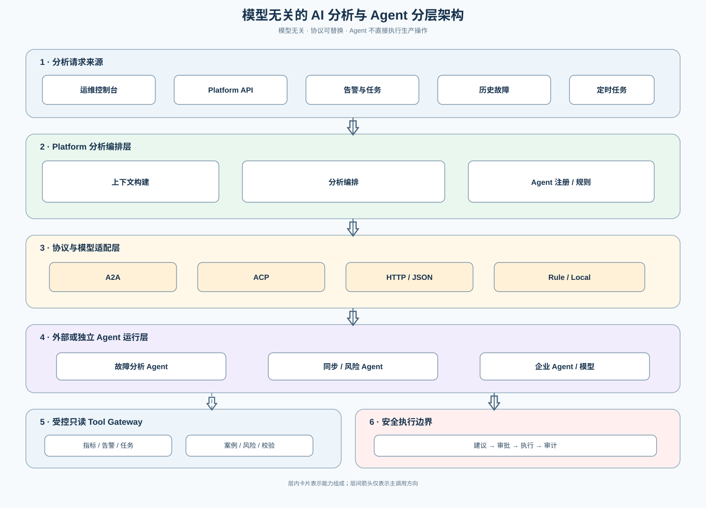

# AI 分析与 Agent 协作架构

## 1. 目标

AI 是 Redis 治理平台的分析和辅助决策能力，不是生产执行器。平台通过统一分析上下文调用不同模型或 Agent，持续吸收历史线上故障，输出可审计的结论、证据和建议。

## 2. 模型无关抽象

业务层只依赖 `AnalysisAgentClient`，不依赖某个模型 SDK、厂商名称或 Agent 框架。实现可以包括：

- 规则分析：无模型时提供确定性告警解释和门禁判断。
- HTTP/JSON：用于本地模型或 OpenAI-compatible 服务快速接入。
- A2A：用于跨系统、跨团队、需要异步 Task 和独立生命周期的远程 Agent。
- ACP：用于兼容企业内部已有的 Agent Manifest、发现和运行平台。

A2A/ACP 只负责 Agent 间通信；指标、告警、同步状态和报告通过受控只读 Tool Gateway 提供。Agent 不直接连接 Redis、MySQL 或凭证表。

## 3. 标准交互

平台内部统一提交 `AnalysisRequest`，包括分析类型、资源和任务 ID、时间窗口、结构化证据引用、历史案例引用、脱敏策略和输出要求。Agent 返回统一的 `AnalysisResult`：结论和摘要、证据引用、根因候选和置信度、排查步骤与建议动作、是否需要人工审批，以及协议/模型/提示模板版本。

Agent 只返回建议，不直接执行同步、清理、切换、Redis Console 或其他生产写操作。建议动作必须重新经过规则校验、审批、幂等、版本检查和审计。

## 4. 历史故障输入

历史故障作为可检索案例，不直接无差别加入模型训练集。案例包含故障类型、时间线、指标和告警、同步/校验状态、根因、处理步骤、恢复结果、适用 Redis 版本和拓扑，以及 `DRAFT`、`VERIFIED`、`RETIRED` 状态。

当前故障分析时，平台先生成故障指纹，再检索相似案例，将案例作为上下文证据提供给 Agent。人工确认后的处理结果可以沉淀为新案例或更新旧案例；事实证据和人工推断必须分开保存。

## 5. 配置与降级

Agent 注册配置至少包括名称、协议、Endpoint、能力、支持场景、超时、重试、并发、优先级、启停状态和认证引用。认证 Header、API Key、签名密钥均为 write-only 加密配置。

调用链必须支持超时、取消、幂等、结果校验和降级。远程 Agent 不可用时回退到规则分析；AI 服务故障不能影响资产、同步、采集、风险和治理主流程。

## 6. 数据与安全边界

- 不向 Agent 发送 Redis 密码、密文、主密钥或完整 Value。
- 企业内部排障场景可以受控展示 Key，但不进入日志、指标、审计、异步 payload 或外部通知。
- Tool Gateway 默认只读，按分析场景限制字段和时间范围，避免高基数或无界查询。
- 所有分析请求、结果、Agent 版本和证据引用都关联 requestId，并保留审计记录。
- Agent 结果不能改变同步 checkpoint/fence、治理审批状态或主备关系。

## 7. 推荐落地顺序

1. 先实现规则分析和统一 `AnalysisAgentClient`，确保无模型也可用。
2. 增加 HTTP/JSON Adapter，完成本地联调和结果契约验证。
3. 增加 A2A Adapter，支持远程分析 Agent、Task 状态和异步结果。
4. 按企业 Agent 平台需要增加 ACP Adapter。
5. 最后增加历史案例检索、质量评分和可选向量索引。

## 8. 非目标

首期不实现模型训练、自动修复、自动切换、自动清理、Agent 直接访问 Redis、Agent 自主审批或绕过平台权限的工具调用。
