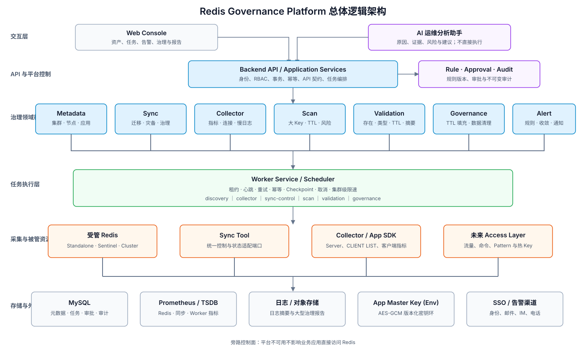
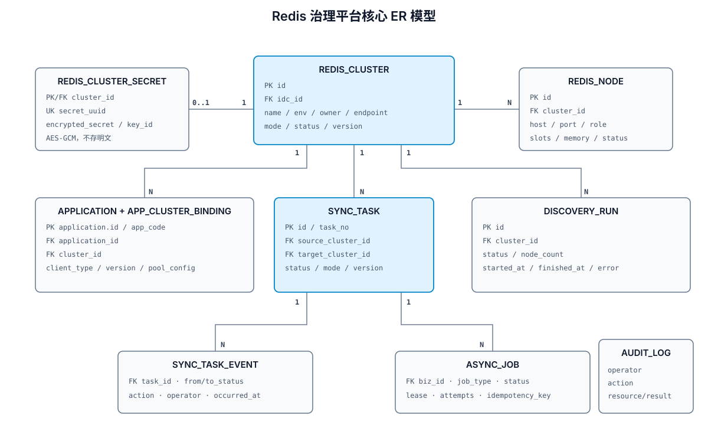

# Redis Governance Platform 总体架构设计

## 1. 建设目标与边界

平台定位为企业 Redis 的旁路治理控制面，核心目标是：管资产、管同步、管风险、管数据质量。平台不承载业务 Redis 流量，规则系统负责执行，AI 助手负责分析，人工负责决策，平台负责审计。

完整能力范围包括：

- Redis 集群、节点、应用、负责人和服务等级的统一资产管理。
- 迁移、灾备、治理三类数据同步任务的生命周期管理。
- Redis Server、客户端连接和同步工具的指标采集与告警。
- 源端和目标端的数据一致性校验。
- 大 Key、无 TTL Key、垃圾数据等风险发现。
- TTL 填充、数据清理等需要 Dry Run、审批、限速和审计的治理动作。
- 基于指标、日志、告警和治理结果的 AI 辅助分析。

当前非目标：Redis 集群部署、节点安装、自动扩缩容、slot rebalance、自动故障切换、redis.conf 批量下发、自动重启以及 Redis Proxy。未来 Access Layer 属于可选增强，不是现阶段依赖。

本文描述目标架构；跨模块不可变边界以[架构契约](architecture-contract.md)为准，重大取舍以
[ADR](adr/README.md)为准。文中列出的后续模块不表示已经上线。

## 2. 架构原则

1. **旁路治理**：不进入业务请求链路，平台故障不能影响应用访问 Redis。
2. **控制面与执行逻辑分离**：API 保存意图和任务，Worker 组件执行耗时或高风险操作；首期部署在同一进程。
3. **模块化单体优先**：先按领域隔离代码和数据边界，达到独立扩缩容或团队拆分条件后再拆服务。
4. **所有生产动作可控**：支持 Dry Run、审批、限速、暂停、恢复、幂等和审计。
5. **元数据与指标分离**：业务状态进入 MySQL，时序指标进入 Prometheus/TSDB，日志进入日志平台。
6. **凭证与数据最小暴露**：Redis 密码使用应用层 AES-256-GCM 加密；不采集完整 value，校验默认使用摘要。
7. **AI 不直接执行**：AI 输出原因、证据和建议，执行仍经过规则、权限和人工确认。

## 3. 总体逻辑架构



平台分为五层：交互层、治理控制层、任务执行层、数据采集与被管资源层、存储与外部集成层。各业务模块是逻辑边界，不代表必须立即部署成独立微服务。

## 4. 模块设计

### 4.1 Metadata / Asset Management

负责 Redis 集群、节点、应用、负责人、业务线、环境、地域、服务等级和集群连接认证。

关键能力：集群 CRUD、集群连接认证、应用绑定、节点发现、拓扑快照、按应用或负责人反查、资产状态维护。Phase 1 每个集群维护一套加密连接账号，供发现、同步、治理和访问层统一使用；节点发现失败时保留上一次成功快照，避免短暂网络故障清空资产。

### 4.2 Sync Management

统一管理三类同步任务：

| 类型 | 场景 | 核心关注点 |
|---|---|---|
| MIGRATION | 老集群迁移到新集群 | 全量进度、增量追平、校验、切换窗口 |
| DISASTER_RECOVERY | 主备机房或地域同步 | RPO、延迟、backlog、持续稳定性 |
| GOVERNANCE | 指定前缀或业务数据处理 | 过滤规则、影响范围、限速和结果 |

同步工具通过统一端口适配，领域状态不直接等同于某个工具的内部状态。标准状态为：

```text
CREATED → CHECKING → READY → FULL_SYNCING → INCR_SYNCING → CAUGHT_UP → FINISHED
                ↘ FAILED       ↕ PAUSED                         ↘ CANCELLED
```

任务保存源/目标集群、同步工具、模式、QPS 限制、检查报告和暂停前状态。工具指标包括全量进度、延迟毫秒数、延迟字节数、处理/失败操作数、重试次数和最后错误。

### 4.3 Redis Collector

Collector 是没有统一访问层时的旁路观测入口，按不同频率采集：

- `INFO server/clients/memory/stats/replication/commandstats`
- `CLUSTER INFO`、`CLUSTER NODES`
- `CLIENT LIST`
- `SLOWLOG GET`
- `LATENCY LATEST`

采集结果分流：稳定资产信息回写 Metadata；时序指标写 Prometheus/TSDB；慢日志和高基数明细进入日志或分析存储；异常事件送 Alert Service。禁止把所有高频指标写入 MySQL。

应用识别依赖 clientName 规范：`app={app};env={env};host={host};instance={instance}`。后续 SDK 可补充命令延迟、超时、错误、连接池、重连和 MOVED/ASK 指标。

### 4.4 Data Validation

用于迁移、灾备和治理任务的数据一致性验证。首期采用抽样校验，比较 key 是否存在、类型、TTL 和 value digest，不保存完整 value。

标准差异类型：`MISSING_TARGET`、`EXTRA_TARGET`、`TYPE_DIFF`、`VALUE_DIFF`、`TTL_DIFF`。校验任务必须记录抽样策略、扫描游标、源目标时刻、容差、差异明细和汇总报告，避免把动态 TTL 的正常偏差误判为失败。

### 4.5 Scan / Risk Detection

扫描服务负责发现风险，不直接修改数据。扫描按集群、节点、DB、前缀和业务拆分分片，由 Worker 限速执行并保存 checkpoint。

- 大 Key：覆盖 string、hash、list、set、zset、stream，采集类型、内存、元素数、TTL 和节点。
- TTL 风险：筛选 `ttl=-1`，按前缀、业务和类型聚合。
- 数据清理候选：前缀数据、无 TTL 数据、空集合及规则命中数据。

扫描使用 `SCAN` 和 `MEMORY USAGE`，不得使用生产阻塞命令；结果中的 key 应支持脱敏或只保留 pattern/hash。

### 4.6 Governance Execution

治理执行器承接 TTL 填充和数据清理，统一流程为：

```text
规则定义 → 扫描/Dry Run → 影响报告 → 人工审批 → 限速执行 → 校验 → 结果报告
```

所有任务必须可暂停、可恢复、可审计。删除优先使用 `UNLINK`，批次大小和 QPS 可配置；审批对象绑定规则版本和 Dry Run 快照，审批后规则变化必须重新审批。

### 4.7 Alert Service

Alert Service 接收 Collector、Sync、Validation 和 Worker 产生的标准事件，完成规则计算、去重、收敛、静默、升级和通知。

| 等级 | 典型告警 |
|---|---|
| P1 | 同步失败、Redis 不可连接、关键数据校验失败、Worker 集群不可用 |
| P2 | 同步延迟升高、全量进度卡住、内存异常增长、backlog 风险 |

告警必须关联 clusterId、applicationId、taskId、证据指标和处理状态，使后续 AI 分析与人工处置使用同一上下文。

### 4.8 AI Analysis Assistant

AI 服务只读取平台授权的数据，通过标准化分析上下文访问告警、指标、日志、集群信息、同步状态、扫描报告和校验差异。

输出包含结论、证据、置信度、排查步骤和建议，不直接调用生产执行器。第一阶段覆盖告警分析、同步延迟分析、大 Key 风险说明和一致性差异解释。未来接入 Access Layer 后，可关联应用流量、命令、key pattern、热 Key、无 TTL 写入和大 Value 写入。

### 4.9 Approval、Audit 与 Rule Engine

审批、审计和规则是跨模块平台能力：

- Rule Engine 描述扫描条件、告警阈值和治理动作，规则必须版本化。
- Approval 保存申请、审批人、决策、意见、过期时间和绑定的 Dry Run 版本。
- Audit 只追加写，记录操作者、动作、资源、请求摘要、结果、requestId 和时间。
- RBAC 最小角色为 Viewer、Operator、Approver、Admin；申请人与审批人应支持职责分离。

## 5. 核心数据流

### 5.1 资产发现与持续采集

```text
API/调度器 → 创建发现或采集 Job → Worker 领取租约 → 连接 Redis
→ 解析拓扑/指标 → 原子刷新资产快照 + 指标分流 → 记录运行结果与审计
```

### 5.2 同步迁移闭环

```text
创建任务 → 源目标预检查 → 启动同步工具 → 采集进度和延迟
→ 增量追平 → 数据校验 → 人工确认切换 → 完成或继续灾备同步
```

### 5.3 风险治理闭环

```text
扫描规则 → 分片扫描 → 风险结果 → Dry Run → 审批
→ 限速治理 → 结果校验 → 报告/告警/审计
```

### 5.4 告警分析闭环

```text
指标/日志/任务事件 → 告警规则 → 去重收敛 → 通知
→ AI 汇总证据与建议 → 人工决策 → 平台动作与审计
```

## 6. Worker 与异步任务架构

所有耗时动作统一建模为 Job，业务任务与执行任务分离：SyncTask、ScanTask、ValidationTask、GovernanceTask 表示业务；AsyncJob 表示一次可调度执行。

当前物理形态已将真实同步数据面拆为独立 `governance-sync-service`：Platform 持有控制命令、
任务期望状态与审计，Sync Worker 以共享 MySQL 租约领取命令并执行 PSYNC、spool、目标写入。
目标 Redis checkpoint/fence 是同步写入的最终事实；详情见[同步管理面与 Worker 分离](sync-control-worker-separation.md)。

Worker 使用数据库租约或调度平台领取任务，具备心跳、超时接管、有限重试、指数退避、幂等键、checkpoint 和取消信号。任务按 `discovery`、`collector`、`sync-control`、`scan`、`validation`、`governance` 分队列或执行池，防止大扫描耗尽同步监控资源。

治理执行类任务优先级低于同步控制和 P1 采集；每个集群设置并发上限，避免多个扫描或治理任务叠加冲击 Redis。

## 7. 数据架构



| 存储 | 保存内容 | 不应保存 |
|---|---|---|
| MySQL | 资产、任务、规则、审批、状态事件、审计、报告索引 | 高频时序点、Redis 明文密码、完整 value |
| Prometheus/TSDB | Redis、同步工具、Worker 和应用 SDK 指标 | 业务配置、审批状态 |
| 日志平台 | Worker/工具日志、慢日志摘要、带关联 ID 的事件 | 未脱敏凭证和敏感 value |
| 对象存储（可选） | 大型扫描、校验和治理报告 | 在线事务状态 |
| 进程环境变量 | AES-GCM 版本化主密钥环 | 业务元数据、Redis 密码与密文 |

核心实体组：

- 资产：`redis_cluster`、`redis_cluster_secret`、`redis_node`、`application`、`app_cluster_binding`、`discovery_run`。
- 同步：`sync_task`、`sync_task_event`、`sync_runtime`、`sync_channel_checkpoint`、
  `sync_metric_snapshot`（仅低频摘要）和 `sync_full_progress`（按通道/Lane 的观测进度）。
- 采集告警：`collector_job`、`alert_rule`、`alert_event`、`notification_record`。
- 数据质量：`validation_task/result`、`scan_task/result`、`governance_task/batch`。
- 平台控制：`async_job`、`approval_instance`、`rule_definition`、`audit_log`。

通用规则：BIGINT 主键；时间统一以 UTC 存储；枚举保存稳定字符串；核心查询字段使用结构化列，非查询配置才使用 JSON；任务表使用 version 乐观锁。

## 8. API 与事件契约

REST API 按领域划分：

- `/api/v1/clusters`、`applications`
- `/api/v1/sync-tasks`
- `/api/v1/collector-jobs`、`metrics`
- `/api/v1/scan-tasks`、`validation-tasks`
- `/api/v1/governance-tasks`、`approvals`
- `/api/v1/alerts`、`analysis-reports`
- `/api/v1/jobs`、`audit-logs`

写接口携带身份上下文和 `Idempotency-Key`；资源更新使用版本号；响应包含 requestId。模块间事件至少包含 eventId、eventType、occurredAt、resourceType、resourceId、clusterId、taskId、severity 和 payloadVersion。初期可使用数据库 Outbox + Worker 投递，确有吞吐需求后再引入消息队列。

## 9. 安全与风险控制

- 企业 SSO/RBAC 是后续接入项，当前尚未实现授权判定；`X-Operator` 仅用于审计。高风险同步
  动作已要求预检查、写隔离、二次确认与审计；治理动作在 Phase 3 引入审批后才开放。
- Redis 密码只以 AES-256-GCM 密文保存，主密钥只来自进程环境变量；查询接口、日志、审计和任务 payload 均不得包含密码或密文。旧 `env://` 仅作为迁移兼容。
- 平台 Redis 账号按只读采集、同步、治理分别授权；扫描账号不得拥有删除权限。
- 对 SCAN、MEMORY USAGE、校验和治理设置全局/集群/任务三级限速和熔断。
- 治理动作必须有影响上限；实际命中量超过 Dry Run 容差时自动停止。
- AI 输入遵守租户、业务线和角色权限，不向模型发送 Redis 完整 value 或凭证。

## 10. 可观测性与可靠性

平台自身采用统一 requestId、jobId、clusterId、taskId 关联日志。关键指标包括 API 延迟和错误率、队列深度、Job 时长/失败/重试、Worker 心跳、采集成功率、同步延迟、扫描速率、治理失败量和通知失败率。

API 可多实例无状态部署；Worker 水平扩展并依赖租约避免重复执行；MySQL 高可用与每日备份；Prometheus 按企业标准部署。MVP 的 RPO 24 小时、RTO 4 小时只是初始基线，上线前需按服务等级重新确认。

## 11. 技术架构与工程映射

技术栈：JDK 17、Spring Boot、MyBatis、MySQL、React、Ant Design、Prometheus、Grafana。调度可从数据库租约起步，达到集中调度需求后接 Quartz 或 XXL-JOB。

当前代码采用模块化单体：

| 当前 Maven 模块 | 作用 | 未来逻辑模块映射 |
|---|---|---|
| governance-common | 基础类型和错误规范 | 所有模块共享的最小内核 |
| governance-domain | 领域模型和端口 | asset/sync/scan/alert 等领域包 |
| governance-application | 用例编排 | 各领域 Application Service |
| governance-infrastructure | MySQL、Redis、工具适配 | Collector、Sync Tool、存储适配器 |
| governance-api | REST 契约 | 各领域 Controller |
| governance-bootstrap | Platform API、Flyway、资产发现调度 | Backend API、Collector/Scan/Validation/Governance Worker |
| governance-sync-protocol | RESP、PSYNC、RDB、命令规划 | 独立同步协议内核 |
| governance-sync-service | 独立 Sync Worker、lease/fence/spool | Sync 数据面 Worker |

未来只有在独立发布、团队所有权、故障隔离或资源模型出现明确需求时，才将逻辑模块拆成 `cluster-service`、`sync-service`、`collector-service`、`scan-service`、`alert-service` 和 `ai-analysis-service`。

## 12. 分阶段落地

| 阶段 | 目标 | 主要交付 |
|---|---|---|
| [Phase 1](phase1-tasks.md) | 资产、同步与验收可控 | 工程基线、数据库、Cluster CRUD、Node Discovery、Application Binding、Sync Task、数据校验报告与状态机 |
| Phase 2 | 风险可见、异常可感知 | Collector、指标采集、同步监控、告警、大 Key 检测 |
| Phase 3 | 数据质量治理闭环 | TTL 填充、数据清理、审批、审计和结果报告；数据校验扩展为修复前门禁 |
| Phase 4 | 运维经验辅助决策 | 告警分析、同步分析、大 Key/校验分析、自动报告 |

Phase 1 当前物理形态是 Platform（API、资产发现调度）+ 独立 Sync Worker + MySQL；两者可以同机
或分机部署。Phase 2 引入 Prometheus/Grafana 与采集执行池；Collector、Scan、Alert 等仍先按
逻辑模块落地，只有出现明确隔离或扩缩容需求时再拆分 Worker 进程。Phase 3 才开放有审批保护的
数据修改能力；Phase 4 只增加分析能力，不改变生产动作权限边界。

## 13. 关键待确认项

1. 首个同步工具及其控制、状态和指标接口。
2. 首期支持的 Redis 拓扑类型、版本范围和 TLS/ACL 组合。
3. 集群数、节点数、并发同步数、Key 规模和可接受扫描负载。
4. 企业 SSO、日志平台、告警渠道和审批系统的接入方式；外部 KMS 作为后续可选增强。
5. 数据校验抽样率、TTL 容差、差异失败阈值和报告保留周期。
6. 治理动作的审批职责、单次影响上限、限速基线和紧急停止机制。
7. AI 使用的模型部署方式、数据出域规则和分析结果保留策略。
