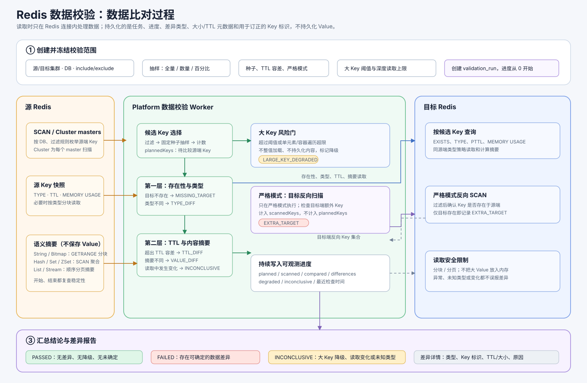
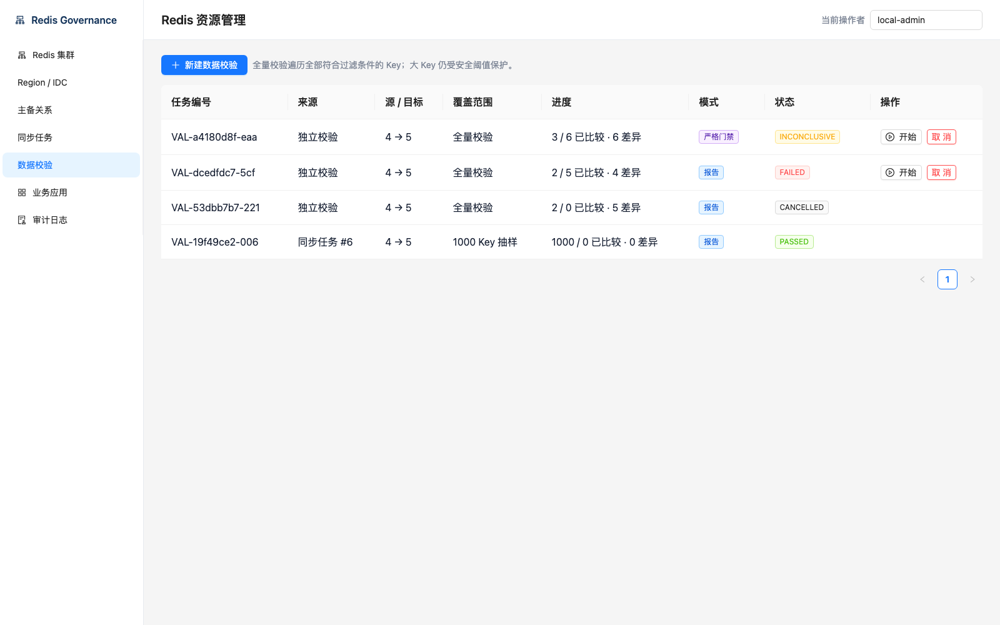

# Redis 数据校验

数据校验是 Platform 的控制面能力，用于发现源、目标 Redis 数据不一致的风险；它不是数学意义上的全量一致性证明，也不会读取、记录或展示业务 Value。

## 运行模型

`validation_task` 定义源/目标、DB、过滤规则、抽样种子和资源上限。启动后创建 `DATA_VALIDATION` 异步任务，由 Platform 内的租约 Worker 执行。结果保存为 `validation_run` 与 `validation_difference`：差异记录保存可排障的 Key 名称及 Key SHA-256 摘要，但不保存 Redis Value。

默认从源端抽样 SCAN，严格模式再从目标端反向扫描，从而发现 `EXTRA_TARGET`。比较顺序为存在性、类型、TTL 和摘要。校验中的 Key 变化记为 `INCONCLUSIVE_CHANGED_DURING_READ`，而不是数据不一致。

## 数据比对过程

全量、固定数量和百分比抽样都会先从源端得到候选 Key；全量与百分比会预统计 `plannedKeys`。随后每个候选 Key 依次校验目标存在性、类型、TTL 与语义摘要。严格模式还会反向扫描目标端，因此其 `scannedKeys` 可能高于 `plannedKeys`，额外的目标 Key 会记为 `EXTRA_TARGET`。

## 大 Key 保护

默认大 Key 阈值为 64 MiB，最大自动深度比较大小为 8 MiB。先通过 `MEMORY USAGE` 判断对象大小；超限 Key 只记录类型、大小、TTL 和摘要结果，标记为 `LARGE_KEY_DEGRADED`，不读取 Value。

在允许深度比较的范围内，适配器使用 Redis 序列化表示计算摘要，并在读取前后复查类型和内存大小。对象发生变化、未知类型、或读取结果超过上限时安全降级。差异 API 和数据库保存 Key 名称以支持问题排查和数据订正；正常 UTF-8 Key 原样显示，含控制字符的二进制 Key 以 `base64:` 编码显示。日志、事件、指标和审计不记录 Key 或 Value，数据库也不保存 Redis Value。

报告模式允许带大 Key 风险完成；严格模式下只要存在降级或未验证项，任务状态为 `INCONCLUSIVE`，不能作为迁移或切换的自动门禁结论。

## 演示报告

下面是本地 Standalone 源、目标集群的一次严格全量校验。任务预先统计出 6 个待比较的源端 Key；严格模式还会反向扫描目标端，因此 `已扫描` 可以大于 `待比对 Key`，用于发现仅存在于目标端的 Key。

截图中的 `VAL-a4180d8f-eaa` 展示了 6 类可定位的结果：`EXTRA_TARGET`、`MISSING_TARGET`、`TYPE_DIFF`、`VALUE_DIFF`、`TTL_DIFF` 与 `LARGE_KEY_DEGRADED`。由于这是严格门禁模式，存在大 Key 降级项时结论为 `INCONCLUSIVE`，不能自动作为迁移或切换放行依据。

> Key 名称属于业务元数据。当前平台尚未接入 RBAC，生产环境应仅向具备 Redis 排障权限的人员开放数据校验结果接口和数据库查询权限。详细决策见 [ADR-007](adr/ADR-007-validation-key-retention-for-remediation.md)。

## 当前边界

- 支持 Standalone、Sentinel 和 Cluster 的连接与抽样扫描；Cluster 固定 DB 0。
- 支持单边缺失、类型、TTL 与数据摘要风险检查。
- 不执行自动修复，不校验 Module 数据或 Stream Consumer Group 状态。
- 支持全量、固定数量和百分比抽样。全量/百分比任务会预统计源端符合过滤规则的待比较 Key 数量；严格模式的目标反向扫描不包含在该预估内。
