# Redis Ops 功能介绍与演示图册

截图日期：2026-09-14。来源：本地运行页面，1600 × 1100 桌面视口。

本图册用于内部研发、运维介绍。截图是当前真实页面，不是设计稿或生产验收报告；包含本地演示资产、回环地址、演示账户名称和历史任务。没有包含密码、密钥或 Redis value。对外分享前仍需复核账户名、资产信息和 Key 前缀是否允许披露。

## 建议演示顺序（约 5 分钟）

1. 资产列表：统一登记不同部署模式的 Redis，按环境、负责人定位资产。
2. 新增集群：说明连接信息、机房、认证及可选的应用多选关联；演示时不提交。
3. 应用关系：展示一个业务应用关联多个集群，区分资产关系与实际连接配置。
4. 同步任务：查看源/目标、任务状态和 Worker 归属；不启动或恢复任务。
5. Key 分布：介绍范围、规则、预算三步流程，再打开已有结果说明占比、规则快照及 CSV 导出。
6. 风险扫描及用户管理：介绍历史扫描和平台角色边界。

## 1. Redis 资产管理

### 登录入口（2026-09-15 更新）

桌面采用品牌介绍与登录卡片双栏布局，手机端保留品牌和表单。仅调整呈现，不改变本地账号登录、会话和权限逻辑；不展示未接入的企业认证入口。

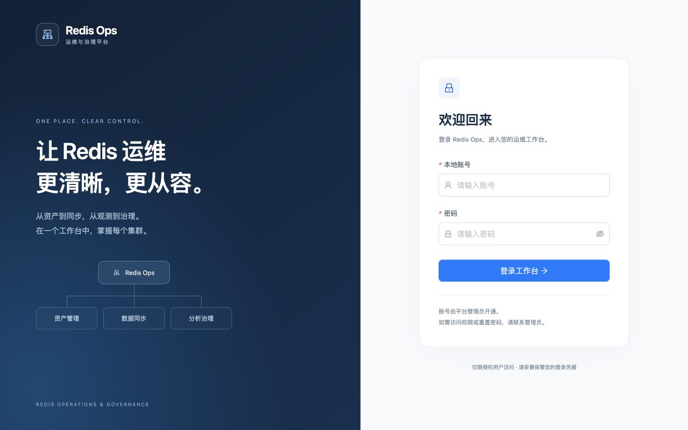

[手机登录页截图](screenshots/11-login-mobile.png)

集中展示集群名称、环境、部署模式、Endpoint、机房、负责人和状态。当前截图包含本地 Standalone 和 Cluster 演示资产。

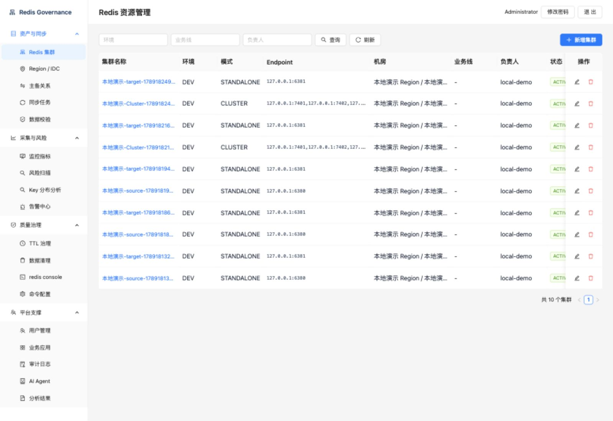

## 2. 新增集群与应用关联

填写集群基础信息、Region / IDC 和可选认证信息；可一次选择多个业务应用。保存时先创建集群，再逐项关联；部分关联失败不会回滚集群，需从详情补充。截图为未提交的空表单，不代表成功创建。

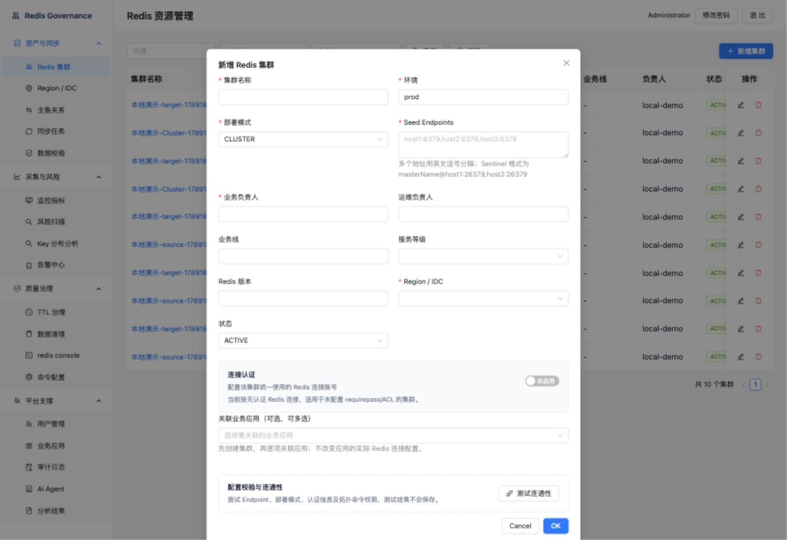

## 3. 应用与集群多对多管理

从业务应用侧查看和新增关联集群；集群详情也提供反向管理入口。可维护客户端元信息及逐项解绑。解绑只删除关联，不删除资产或 Redis 数据，也不修改应用的真实连接配置。

当前截图展示既有的五项关联，本次截图没有新增或解除关系。

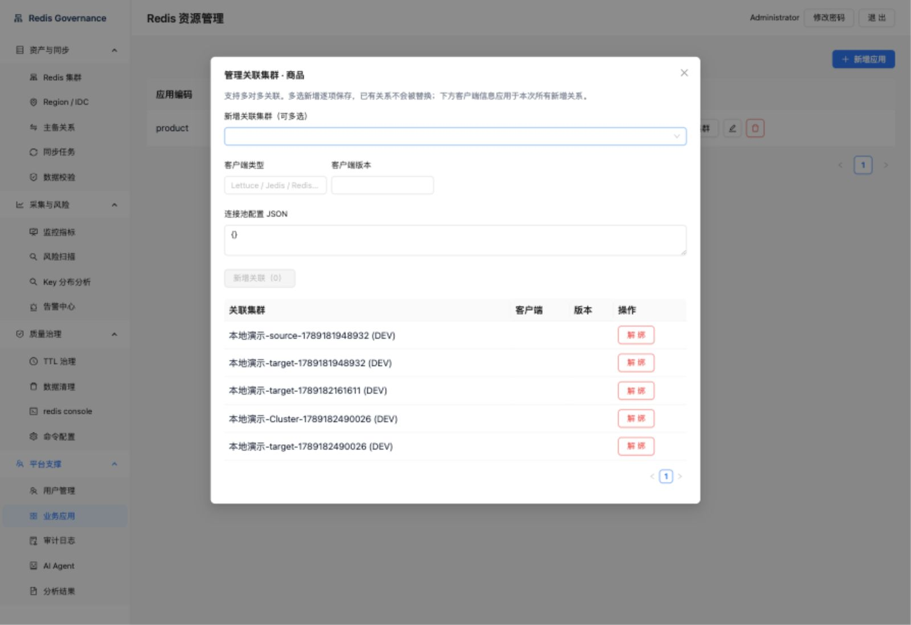

## 4. 同步任务与 Worker 归属

列表集中展示源/目标、任务标识、状态及 Worker / 机器 IP 栏。可通过任务入口查看进一步信息。

当前均为历史任务，包含完成和失败状态，未分配或已释放 Worker。此图不用于证明实时 Worker 在线或当前同步吞吐量，也不是新一轮同步验收。

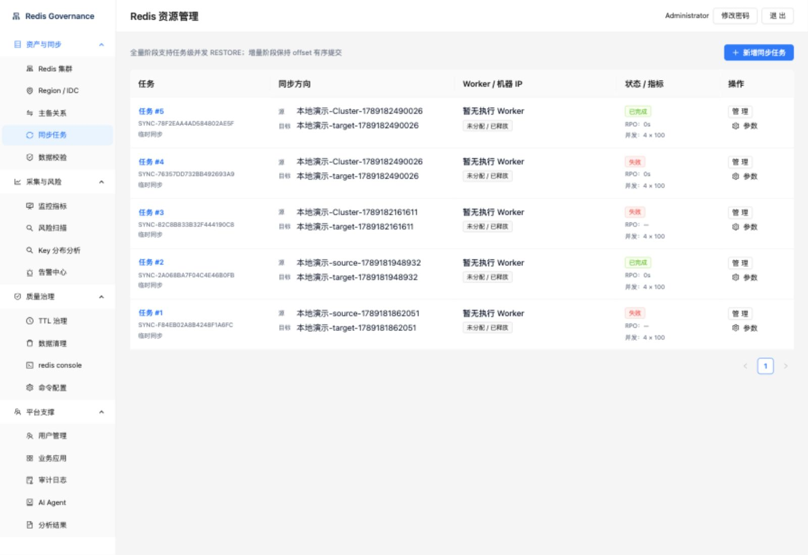

## 5. Key 前缀 / 业务归属分布分析

按“选择范围 → 配置规则 → 确认执行”组织操作。有限采样是可选步骤；正式分析受扫描预算约束。本次仅打开页面及已保存结果，没有发起采样或扫描。

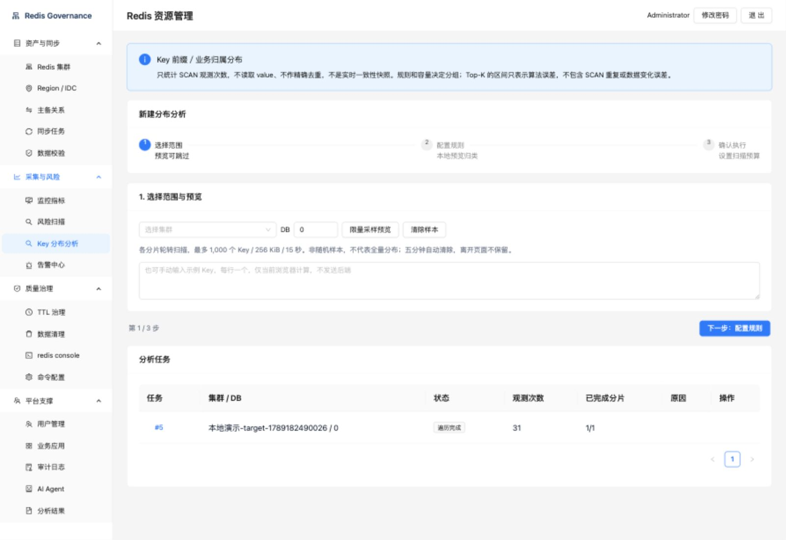

结果保存规则快照，展示分组、观测次数、占比和算法误差信息，并提供 CSV 导出入口。统计口径为 SCAN 观测次数，不是精确去重 Key 数，也不是一致性快照。

示例任务 #5：31 次观测、1/1 分片完成。分组包含本地演示前缀及同步内部前缀，不能据此推断真实业务归属。

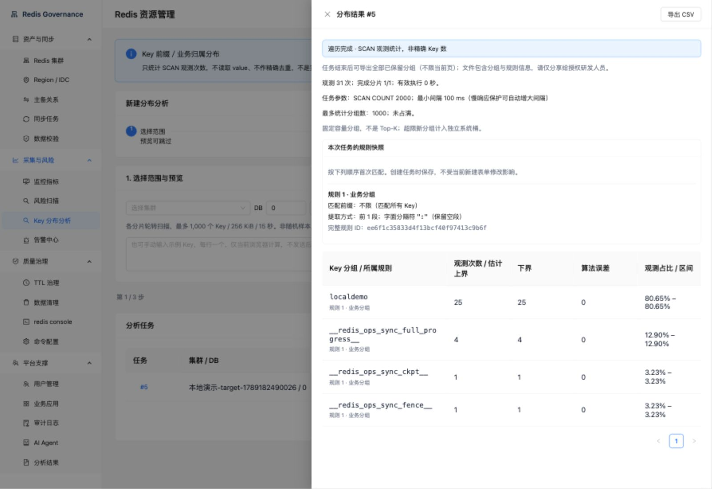

## 6. 风险扫描

页面展示扫描任务、集群、Pattern、阈值及状态。当前为两条已完成的本地历史任务；本次没有点击启动，也没有重新扫描 Redis。

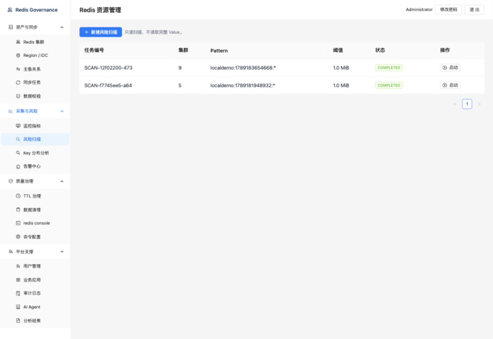

## 7. 本地用户与角色

管理员维护本地用户及授权，普通运维用户使用运维功能。企业认证留有扩展边界，当前不能宣称 SSO / LDAP 已接入。

截图只展示本地演示管理员，不展示密码，也没有修改授权或重置密码。

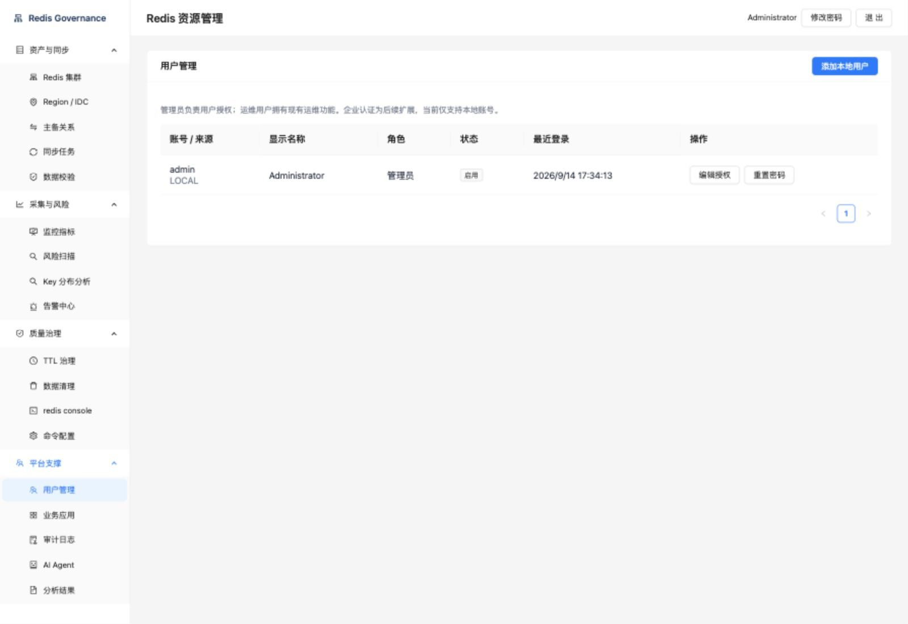

## 8. 监控指标（2026-09-15 修复）

页面现通过受登录保护的业务指标 API 获取集群快照，已在本地确认 Standalone / Cluster 的状态、内存、连接数和 Ops/s 正常显示。Actuator 仍保持默认拒绝策略。接口说明见[业务指标接口](../collector-metrics-api.md)。

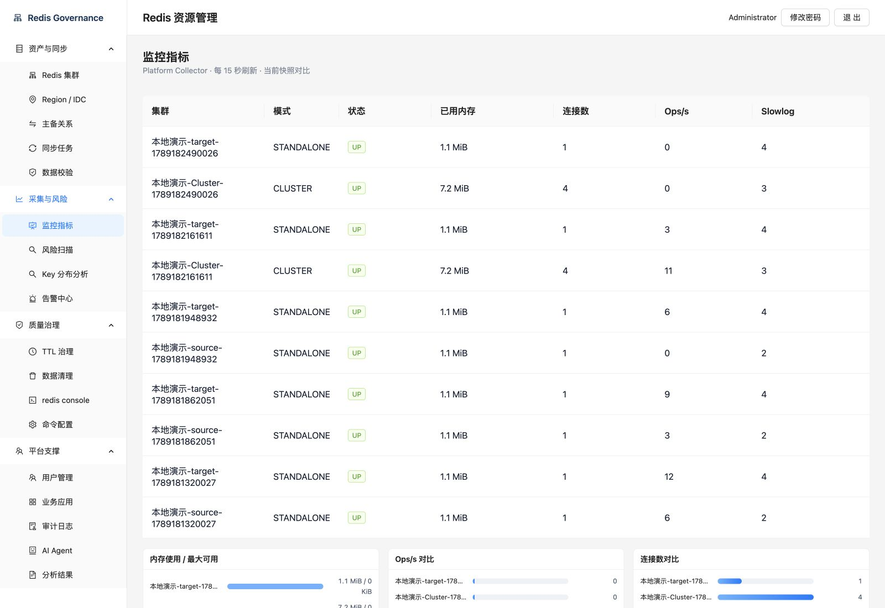

下面保留 2026-09-14 的历史问题截图：旧页面直接请求 Actuator 被拒绝，不能将其视为当前状态。

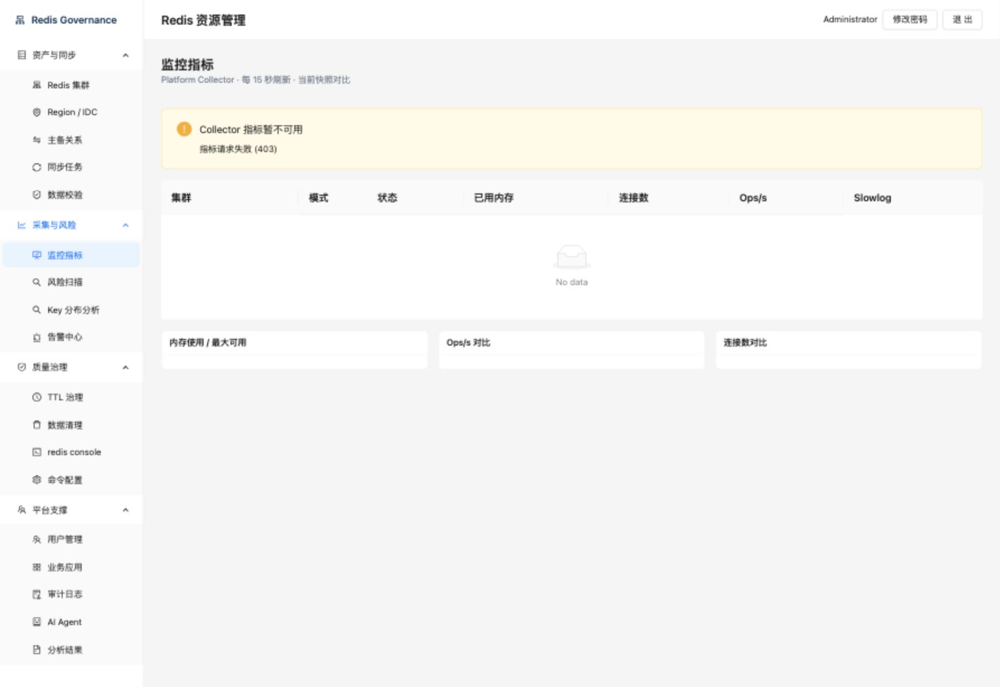

## 素材维护与范围

- PNG 按编号保存在 `screenshots/`；本 Markdown 使用相对链接，可整体复制给研发或插入 PPT。
- 后续更新：使用本地演示环境登录，固定视口，按上述顺序只读浏览，等待页面数据完成加载后截图；逐张检查无加载占位、敏感字段及错误提示，再更新文案。
- 当前是一次自动采集的图册，不包含无人值守截图脚本，不保存浏览器会话或登录密码。
- 本次未覆盖 TTL 治理、数据清理、Redis Console、主备关系、数据校验、告警和 AI 分析的完整流程；这些页面不能据本图册视为已演示或验收。
- 演示中不执行同步、清理、拓扑切换或权限变更；如需实操，另行明确隔离环境及影响范围。
