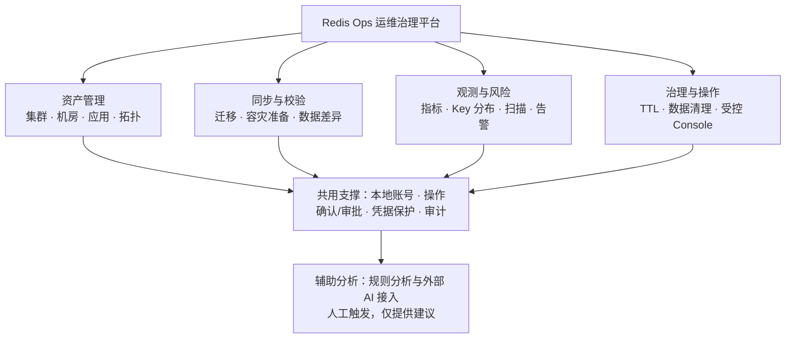
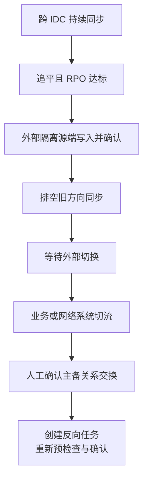
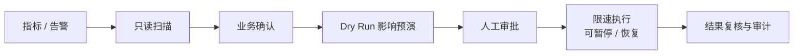
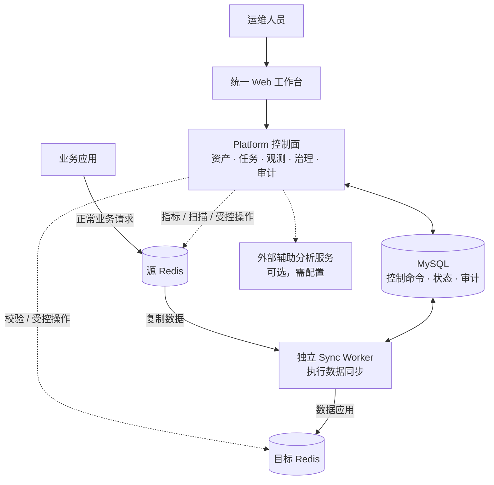
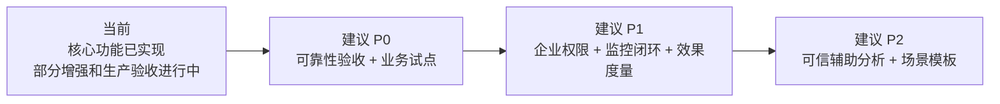

# Redis Ops 平台能力汇报

汇报口径日期：2026-09-18。面向管理层，建议讲述时间 10–15 分钟。

本文依据当前仓库代码、功能说明和已有验收记录整理，未连接生产环境。**“已实现”指仓库具备实现，不代表当前部署已启用或完成生产验收。** 后续路线图为建议优先级，不是已承诺排期。

## 1. 开场：平台解决什么问题

> 我们正在把分散的 Redis 运维工作收敛到统一平台：先把资产和业务关系管清楚，再把数据同步、风险发现和数据治理做成可追踪的操作流程。当前已覆盖资产管理、同步与校验、基础监控告警、TTL 和清理治理，以及权限审计。下一阶段重点是生产可靠性验收、企业权限接入和可量化的治理效果。

平台价值分为三类：

| 管理目标 | 原有痛点 | 平台提供的能力 | 建议衡量方式 |
| --- | --- | --- | --- |
| 管得清 | 集群、机房、负责人和业务关系分散 | 统一资产台账、拓扑发现、应用关联 | 资产接入率、负责人完整率、应用关联覆盖率 |
| 迁得稳 | 同步靠脚本，进度和差异难判断 | 全量与增量同步、追平观测、数据校验、受控切换流程 | 演练成功率、迁移准备耗时、差异关闭率 |
| 治得住 | 内存风险发现晚，人工操作难复盘 | 风险扫描、告警、预演审批、限速治理和审计 | 风险闭环时间、治理前后内存变化、变更审计覆盖率 |

以上是价值目标和建议指标；尚无生产基线，不报告虚构的节省金额、效率提升比例或稳定性承诺。

## 2. 平台能力全景

平台采用旁路管理方式，不承载业务 Redis 请求。业务应用仍直接连接 Redis；平台负责管理、观测和经过授权的数据操作。

| 功能模块 | 当前能够做什么 | 当前状态与边界 |
| --- | --- | --- |
| Redis 资产与拓扑 | 登记 Standalone / Sentinel / Cluster，管理 Region / IDC、负责人，测试连接和发现拓扑 | 已实现；不负责安装、扩缩容、自动重启和槽位迁移 |
| 应用关系 | 应用与集群多对多关联，支持双向维护 | 已实现；属于资产关系，不修改业务连接配置 |
| 主备关系与同步 | 管理跨 IDC 关系、目标 RPO；独立 Worker 执行全量和增量同步，支持暂停、恢复、进度与运行归属查看 | 已实现；受 Redis 版本、命令策略和拓扑条件限制，生产规模及故障矩阵仍需验收 |
| 业务 Key 拆分 | 配置包含/排除规则；全量和增量采用同一范围；支持版本化的多 Key 命令和受限事务策略 | 核心已实现，生产集成验收待完成；未知命令、跨范围事务及不安全跨 Slot 操作会阻塞 |
| 数据校验 | 全量或抽样，识别缺失、额外、类型、TTL、摘要差异，生成可排查报告 | 已实现；大 Key 可降级，严格模式遇未验证项不能自动放行，不自动修复 |
| 监控指标 | 查看可用性、内存、连接数、Ops/s 等基础指标，支持 Cluster 主节点聚合与明细 | 已实现；当前快照不等于完整长期趋势与容量预测体系 |
| 风险扫描 | 按范围发现大 Key、无 TTL Key，提供任务进度、限速、取消和结果查看 | 已实现；只读发现，不自动删除、不获取完整 Value |
| Key 分布分析 | 按前缀或规则分组，有限采样、扫描预算、有界 Top-K、规则快照和 CSV 导出 | 已实现；统计 SCAN 观测次数，不是精确去重 Key 数，也不是内存成本占比 |
| 告警中心 | 基础规则、确认/恢复状态、静默、Webhook 和投递历史/有限重试 | 基础链路已实现，增强验收中；同步 RPO、spool、复制异常联动及渠道认证仍待完善 |
| TTL 治理 | 对无 TTL 数据执行预演、审批、限速设置 TTL，支持暂停、恢复、取消 | 闭环已实现，真实 Redis 验收阶段；写入前再次检查 TTL，业务已有 TTL 时跳过 |
| 数据清理 | 按规则预演，确认影响数量，审批后限速 UNLINK，记录结果 | 闭环已实现，真实 Redis 验收阶段；有影响上限，删除后无平台自动恢复 |
| Redis Console | 按可配置命令目录准入，支持直接执行、确认或审批策略，记录操作 | 已实现；不是完整 redis-cli，不支持跨请求事务、持续订阅或通用多 Key 路由 |
| 用户与审计 | 本地登录，ADMIN / OPERATOR，共享会话，操作者快照和配置变更详情 | 已实现；尚无集群级 RBAC，OIDC / LDAP 尚未接入 |
| 辅助分析 | 手动触发规则/外部分析，保存结论、证据引用和建议；维护 Agent 注册资料 | 基础已实现；外部服务需配置联调，注册资料不驱动运行时，不自主巡检或执行生产操作 |

## 3. 五个典型场景与使用方式

### 场景一：盘清 Redis 资产，快速找到业务负责人

**业务问题：** 某个 Redis 出现告警，无法快速确认所在机房、关联应用和责任人；多业务共用集群，关系不透明。

**操作路径：** `Region / IDC → Redis 集群 → 业务应用 → Key 分布分析`。

1. 建立地域、机房和集群台账，录入环境、负责人、连接信息。
2. 执行连接测试与拓扑发现，核对部署模式和节点信息。
3. 从集群或应用页面维护多对多关系。
4. 对共享集群配置业务前缀规则，先有限采样，再按预算运行分布分析并导出结果。

**汇报产出：** 一份可查询的资产清单、一张应用依赖关系表、一份待业务确认的 Key 分布报告。

**边界：** Key 前缀只是归属线索，需要业务确认；分布占比不能直接当作成本或内存占比。

### 场景二：把共享 Redis 中的一个业务拆到独立集群

**业务问题：** 多业务共用 Redis，容量、变更和故障相互影响，希望逐步拆分。

**操作路径：** `Key 分布分析 → 同步任务 → 数据校验 → 外部应用连接切换`。

1. 与业务确认要迁移的 Key 范围、依赖关系和实际命令类型；检查多 Key、事务、脚本传播等是否符合支持策略。
2. 准备专用目标实例或 DB。**首次全量包含经确认的目标清空步骤；必须明确清空范围，不能把按 Key 过滤理解为只清理目标匹配 Key。**
3. 新建同步任务，配置源/目标、DB、包含/排除规则、速率和命令策略。规则在任务内保持不变。
4. 完成预检查、目标写隔离确认、目标清空确认和任务号二次确认，再启动全量与增量同步。
5. 观察进度、延迟和阻塞原因；追平后执行范围内校验。未验证项或差异需先处置。
6. 在业务变更窗口隔离源端业务写入、完成最终追平与复核，由业务/发布系统修改连接，随后观察新集群。

**汇报产出：** 可追踪的迁移任务、同步观测、差异报告和变更审计。

**边界：** 核心实现已具备，生产前仍需目标版本、真实业务命令、高吞吐、网络故障与拓扑变化验收；平台不自动切流，不承诺零停机。切换后的回退须考虑新写入，不能仅把连接地址改回去。

### 场景三：跨机房容灾准备与受控切换演练

**业务问题：** 有备集群，但不知道数据落后多少，也缺少可复盘的演练步骤。

**操作路径：** `主备关系 → 同步任务 → 数据校验 → 切换流程`。

1. 登记符合关系约束的跨 IDC 集群，建立主备关系并设置目标 RPO（可接受的数据落后时间）。
2. 完成安全确认并建立同步，观察真实复制链路的心跳延迟、数据位置差距和积压。
3. 按演练要求核查数据差异。发起切换需同步任务追平且连续 RPO 样本达标。
4. 外部完成源端业务写隔离并在平台确认；Worker 排空旧方向同步。
5. 平台进入等待外部切换状态，由业务/网络系统切换连接或流量。
6. 操作人在平台确认后，平台交换主备关系并创建反向同步任务；该任务仍需独立预检查和目标清空确认，不会无条件自动启动。

**汇报产出：** 容灾准备状态、实际观测延迟、演练记录和反向任务。

**边界：** 这是受控切换工作流，不是故障自动接管；RPO 不等于 RTO（业务恢复耗时）。流程不能推导出平台具备任意灾难情况下的自动恢复能力。

### 场景四：内存持续上涨，治理无 TTL 和过期业务数据

**业务问题：** Redis 内存增长，但不清楚是容量增长、无 TTL 数据还是废弃业务数据，不敢直接删。

**操作路径：** `监控指标 / 告警中心 → 风险扫描 → TTL 治理 / 数据清理 → 审计日志`。

1. 从监控指标和告警定位异常集群，发起限速风险扫描，识别大 Key 与无 TTL Key。
2. 联合业务确认数据用途：应自然过期的数据选择 TTL 治理；已废弃数据才进入清理治理。大 Key 不直接等于可删除数据。
3. 配置规则、速率、最大影响数量，执行 Dry Run，只查看候选数量和影响范围。
4. 完成业务确认与审批；清理填写变更单号或影响说明。
5. 限速执行，必要时暂停、恢复或取消；查看成功、跳过、失败统计。
6. 复查风险与内存观测，保存治理前后结果和审计记录。

**汇报产出：** 风险清单、预演影响范围、治理统计和复查结果。

**边界：** 设置 TTL 后内存不会必然立即释放；内存变化还受业务写入影响。清理不可由平台自动撤销，需要事先准备适用的备份或恢复方案。

### 场景五：故障排查和操作留痕

**业务问题：** 排障依赖个人命令与经验，事后很难还原谁做了什么、依据是什么。

**操作路径：** `告警 / 同步任务 / 校验结果 → 分析 → Redis Console → 审计日志`。

1. 从告警或任务详情查看状态、错误和证据；必要时手动触发辅助分析。
2. 分析返回结论和建议，操作人核实证据与适用条件。
3. 确需 Redis 操作时，使用命令目录中已启用的命令，遵循其直接执行、确认或审批策略。
4. 在审计与操作记录中查阅执行人、时间、动作、状态和允许记录的配置变更。

**汇报产出：** 有依据的排查路径和可追溯操作记录。

**边界：** AI 仅辅助建议，不直接访问 Redis 或自动执行修改；Console 命令策略需由运维正确配置。超时不等于命令未执行，不应盲目重试。

## 4. 技术架构如何支撑业务价值

- **控制和执行分开：** 页面/API 管理任务；独立 Worker 承担复制数据面，便于独立部署和排查。
- **恢复有明确依据：** 通过租约、写入资格校验和目标端 checkpoint 限制过期 Worker 写入；执行结果不确定时阻塞，避免盲目重放。
- **跨模块失败边界清楚：** 无法安全续传时要求重新确认全量；通知失败不改变告警事实；观测进度不是切换凭证；AI 分析失败不触发生产操作。
- **敏感信息受约束：** 凭据加密，日志、审计和通知不携带完整 Redis Key/Value；内部排障页面受控展示 Key。

## 5. 后续扩展规划

建议按“先生产可靠性，再企业化，再分析智能化”的顺序推进。以下阶段均为建议规划，具体周期需结合人力与试点规模评估。

| 优先级 | 方向 | 建议交付 | 验收标准 |
| --- | --- | --- | --- |
| P0 | 生产可靠性验收 | 补齐 Sentinel/Cluster 故障切换、MOVED/ASK、在线迁槽、持续高吞吐、受限内存、多通道及网络故障矩阵；完成 TTL/清理真实环境验收 | 发布明确的版本/命令/拓扑支持矩阵；关键故障能安全停止或恢复，结果有可复现证据 |
| P0 | 业务试点 | 选择一个业务拆分场景和一个治理场景，小范围试运行，固化操作手册与回退方案 | 试点完成、差异闭环、业务签收，形成可复制流程 |
| P1 | 企业权限与审批 | 对接 OIDC/LDAP，按应用/集群授权；对接工单和审批职责分离 | 非授权资源不可访问；高风险操作有明确审批人和可追踪工单 |
| P1 | 完善监控告警 | 完善长期时序接入、RPO/spool/复制异常联动、通知认证与签名、容量趋势 | 告警有时效、可定位、可追踪送达；时序存储与事务库职责分离 |
| P1 | 治理效果度量 | 汇总资产覆盖、风险存量、任务成功率和治理前后指标；探索按业务维度的容量分析 | 有明确统计口径和生产基线，不把 Key 数占比当内存占比 |
| P2 | 辅助分析增强 | 服务端重建可信证据、接入企业知识库、历史案例和分析效果评测；完善异步分析与认证 | 结论可回溯证据；建议经过人工确认，Agent 不取得生产写权限 |
| P2 | 场景模板与集成 | 将迁移、容灾演练和治理流程模板化，对接发布系统/CMDB/工单 | 减少重复配置，系统之间职责和失败恢复清晰，外部切流仍明确确认 |

不默认纳入扩展承诺：Redis 自动部署扩缩容、跨 Slot 原子事务、双向写入、自动业务切流、AI 无人审批修改生产。若改变现有安全或部署边界，应单独立项并完成架构决策。

## 6. 建议向老板提出的决策事项

1. **确定首个业务试点及负责人：** 建议优先选择归属清晰、命令范围可核验、可安排变更窗口的应用。
2. **安排验证资源：** 隔离 Redis 环境、故障演练窗口、接近生产的数据规模，以及运维/业务联合验收时间。
3. **确认企业集成优先级：** 统一身份、资源权限、告警渠道、工单中哪些是生产准入前置条件。
4. **约定成效口径：** 首轮先建立基线，再报告资产覆盖、迁移耗时、风险闭环时间和容量变化。

## 7. 10 分钟演示顺序与已有素材

| 时间 | 讲述内容 | 建议素材 |
| --- | --- | --- |
| 1 分钟 | 为什么建设：管得清、迁得稳、治得住 | 本文价值表与能力图 |
| 2 分钟 | 已覆盖哪些模块 | 能力全景表，集群和应用关系截图 |
| 3 分钟 | 重点场景：业务拆分与内存治理 | 场景二、四流程图，同步和风险扫描截图 |
| 1 分钟 | 容灾边界：准备、观测、受控切换 | 场景三流程图 |
| 2 分钟 | 下一阶段交付与验收 | 优先级路线图 |
| 1 分钟 | 所需支持与决策 | 四项决策事项 |

已有真实页面素材：

- [资产列表](../demo/screenshots/01-clusters.png)
- [应用关联](../demo/screenshots/07-application-bindings.png)
- [同步任务](../demo/screenshots/03-sync-tasks.png)
- [Key 分布结果](../demo/screenshots/09-distribution-result.png)
- [风险扫描](../demo/screenshots/06-risk-scans.png)
- [监控指标](../demo/screenshots/12-metrics-fixed.png)
- [数据校验报告](../images/validation-demo-report.png)

截图来自已有本地演示记录，不是本次生产运行结果。汇报时可使用已有页面和结果，不必现场发起同步、清空、删除或切换。历史监控异常截图 `05-metrics.png` 不应作为当前功能图使用。

## 8. 汇报收尾口径

> 当前平台已经具备 Redis 运维治理的核心工具链，能把资产、同步、校验、风险和治理操作串成可追踪流程。接下来建议集中完成生产可靠性验证和一个真实业务试点，再推进企业权限、告警联动与辅助分析。我们会用试点数据说明收益，而不是仅用功能数量衡量交付。

## 附：依据与状态核对

- 总体边界：[README](../../README.md)、[架构契约](../architecture-contract.md)。
- 当前模块入口：[前端 App.jsx](../../redis-ops-frontend/src/App.jsx)。
- 同步拆分：[最新交付记录](../sync-business-key-delivery.md)、[拆分方案](../sync-business-key-migration-plan.md)。README 导航仍标“规划中”，本文以 2026-09-17 交付记录及页面代码为准，标为核心已实现、生产门禁待完成。
- 切换流程：[SyncService.java](../../redis-ops-platform/application/src/main/java/io/github/susongyan/redisops/platform/application/sync/SyncService.java)。旧跨 IDC 文档的工具接入、身份和取消恢复描述存在滞后，本文以当前服务代码为准，不承诺取消后自动恢复同步。
- 校验：[数据校验说明](../data-validation.md)；监控：[业务指标接口](../collector-metrics-api.md)。旧 Phase 2 的前端直接读 Actuator 描述不作为当前口径。
- 风险告警：[Phase 2](../phase2-collector-risk-alert.md)；治理：[Phase 3](../phase3-quality-governance.md)。
- 命令操作：[Redis Console](../redis-operation-console.md)；身份权限：[用户接入](../user-access.md)；审计：[审计变更详情](../audit-change-details.md)。
- AI：[分析交付边界](../analysis-interface.md)。

本次仅整理汇报文档，未修改业务代码、未执行 Redis 操作、未重跑构建或生产验收。
