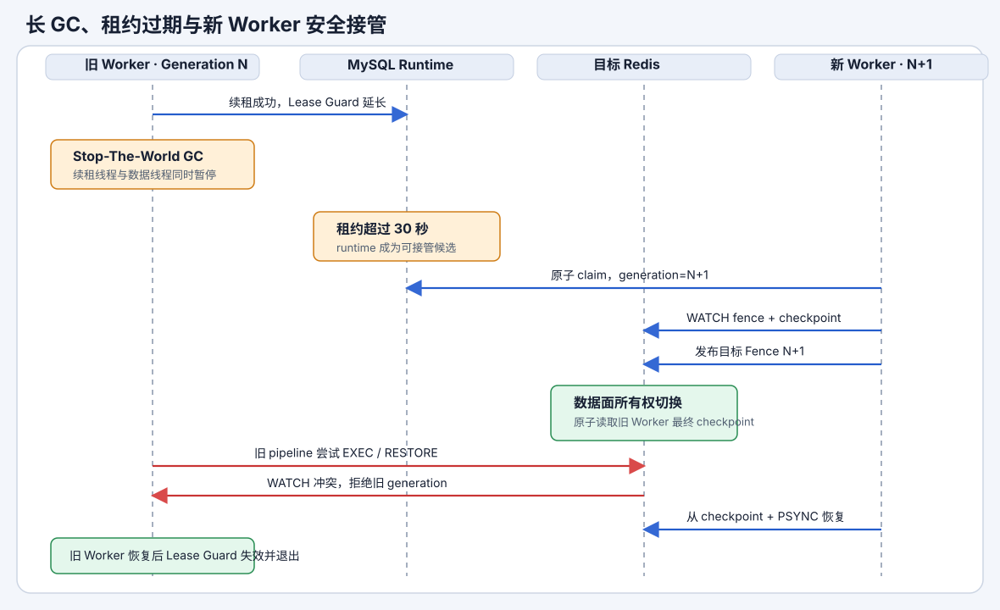

# Sync Worker 停顿、崩溃与安全接管

## 1. 安全模型

系统采用两层互补控制：

- MySQL runtime 租约决定哪个 Worker 可以运行任务。
- 目标 Redis Fence 决定哪个 Worker 的数据事务可以真正提交。

租约用于调度，Fence 是数据面的最终写屏障。只依赖租约无法阻止因长 GC 暂停、随后恢复的旧进程继续使用已经建立的 Redis 连接。



## 2. 租约与 Lease Guard

Worker 领取 `sync_runtime` 时，MySQL 校验原租约为空或已经过期，写入新的 `runtime_id` 和
`lease_owner`，递增 `fencing_generation`，并设置默认 30 秒租期。

Runner 同时持有使用单调时钟的 `LeaseGuard`，在数据库租约截止前预留默认 2 秒安全边界。
续租由独立高优先级线程每 5 秒执行。每次目标写入、源读取、spool fsync、复制 ACK 和恢复操作前
都必须检查 Lease Guard。

Lease Guard 一旦过期或被撤销就不可恢复。旧 Worker 从长 GC 恢复后不能通过“补一次续租”
重新获得写权限，只能销毁 Runner 后重新参与领取。

## 3. 目标 Redis Fence

Standalone 任务使用以下保留 Key：

```text
__redis_ops_sync_fence__:{taskId}:standalone
__redis_ops_sync_ckpt__:{taskId}:standalone
__redis_ops_sync_full_progress__:{taskId}:{lane}
```

Fence 保存 `epoch`、`fencingGeneration`、`runtimeId`、`workerId` 和 `publishedAt`。

新 Worker 的接管顺序固定为：

1. 原子领取过期 MySQL runtime，获得更高 generation。
2. `WATCH fenceKey checkpointKey` 并读取现有 Fence 和 checkpoint。
3. `MULTI/SET fenceKey/EXEC` 发布新 Fence。
4. 如果旧 Worker 在读取期间更新 checkpoint，`EXEC` 冲突并重新读取。
5. Fence 成功后才能读取 spool、发起 PSYNC 或修改目标数据。

Fence 成功时，新 Worker 得到的一定是旧 generation 最后一个合法 checkpoint，offset 不会因
generation 变化而回退。

## 4. 增量与全量冲突处理

每个增量批次同时 `WATCH fenceKey checkpointKey`，校验 epoch、generation、runtimeId 和
workerId，然后在同一个事务中提交业务命令与 checkpoint。

长 GC 发生在旧 Worker 已经检查 generation 之后时：

- 如果旧事务先完成，新 Fence 发布会观察到 checkpoint 变化并重试，新 Worker 从最新 offset 接管。
- 如果新 Fence 先完成，旧事务的 `EXEC` 因 Fence 被修改而失败。
- Redis 不会出现旧事务执行一半、新事务插入其中的情况。

全量阶段允许多连接并发，但每个 lane 的 RESTORE 批次都先 `WATCH fenceKey`，并在同一个
`MULTI/EXEC` 中提交 `RESTORE ... REPLACE ABSTTL` 和 lane 进度。每批同时受任务 pipeline
数量和默认 4 MiB 事务字节上限控制。Functions 加载也使用相同 Fence。

`RESTORE REPLACE ABSTTL` 允许从完整 RDB spool 重新播放；Fence 防止旧快照在接管后覆盖
新 Worker 已恢复的数据。

## 5. Spool 与恢复顺序

恢复依据按以下顺序使用：

1. 目标 Redis checkpoint，确定最终 applied offset。
2. 能取得文件锁且通过 AES-GCM、CRC 和 manifest 校验的本地 spool。
3. 从目标 checkpoint 请求 `PSYNC replId offset`。
4. backlog 不足、replication ID 不兼容或缺少完整 RDB spool 时进入
   `BLOCKED_REQUIRES_FULL_RESYNC`。

Spool 使用任务目录进程锁。同机进程崩溃后操作系统释放锁，新 Worker 可以复用；旧进程只是
长 GC 时仍持有锁，新 Worker 不并发打开旧 spool，而是创建新的接管 spool 并走 PSYNC。
跨机器默认不共享 spool。

恢复流程绝不自动执行 `FLUSHDB` 或接受新的 `FULLRESYNC`。需要重新全量时必须回到平台执行
预检查、写隔离和人工清空确认。

## 6. 崩溃边界

| 崩溃位置 | 恢复行为 |
|---|---|
| 收到源命令但 spool 尚未 fsync | 未 ACK，源端会重发 |
| spool 已 fsync但尚未 ACK | 允许重发，按复制 offset 去重 |
| 已 ACK但尚未应用目标 | 从 spool 或源 backlog 恢复 |
| 目标事务提交前 | 业务命令和 checkpoint 都不生效 |
| 目标事务提交后、MySQL 更新前 | 读取目标 checkpoint 重建 MySQL 摘要 |
| 全量 RESTORE 批次提交后 | 从完整 RDB 重新播放并收敛 |
| 跨机接管且 backlog、全量 spool 均不可用 | 阻塞并等待人工重新全量 |

## 7. 自动接管与观测

恢复扫描器只处理租约过期且任务处于 `STARTING`、`FULL_SYNCING`、`INCR_SYNCING`、
`CAUGHT_UP` 或 `RESUMING` 的 runtime。多个 Worker 可以同时发现候选任务，但只有一个能够
通过 MySQL 条件更新。

成功者依次进入 `TAKEOVER_CLAIMED`、`FENCE_PUBLISHING`、`RECOVERING_SPOOL` 或
`RECOVERING_PSYNC`。平台记录 `LEASE_EXPIRED`、`TAKEOVER_STARTED`、`FENCE_PUBLISHED`、
`RECOVERY_FROM_SPOOL`、`RECOVERY_FROM_PSYNC`、`OLD_WORKER_REJECTED` 和
`FULL_RESYNC_REQUIRED` 事件。

运行页面同时展示 MySQL generation、目标 Fence generation、Fence 发布时间、恢复来源、
接管次数、租约、Worker 心跳和 spool 使用量：

- 两个 generation 一致表示控制面与数据面属于同一 Worker。
- MySQL generation 更大但 Fence 尚未更新表示新 Worker 仍在 `FENCE_PUBLISHING`，不能写目标。
- `OLD_WORKER_REJECTED` 是旧进程或在途事务被正常拒绝，不代表目标数据损坏。
- `BLOCKED_REQUIRES_FULL_RESYNC` 表示无法从 backlog 或完整 spool 继续，需要人工重新全量。
