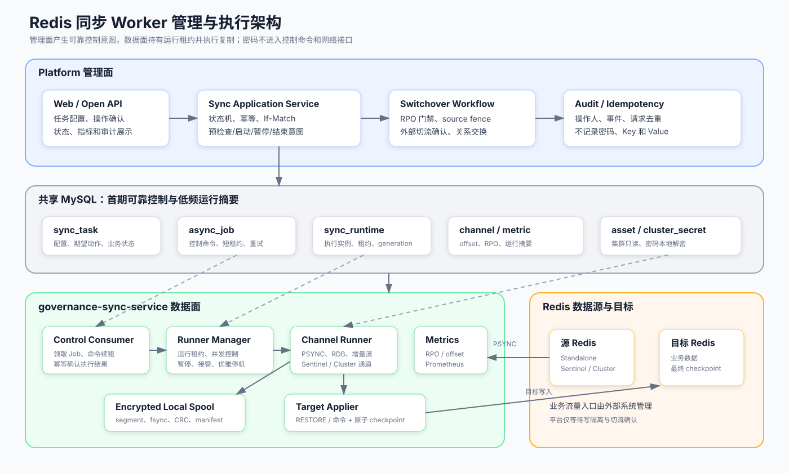
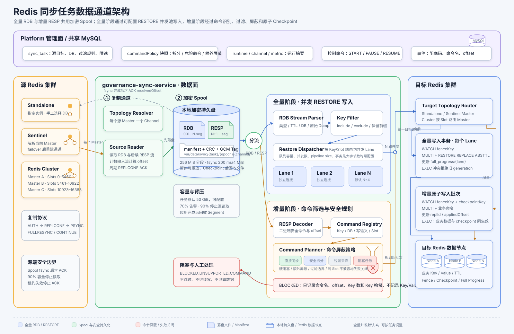
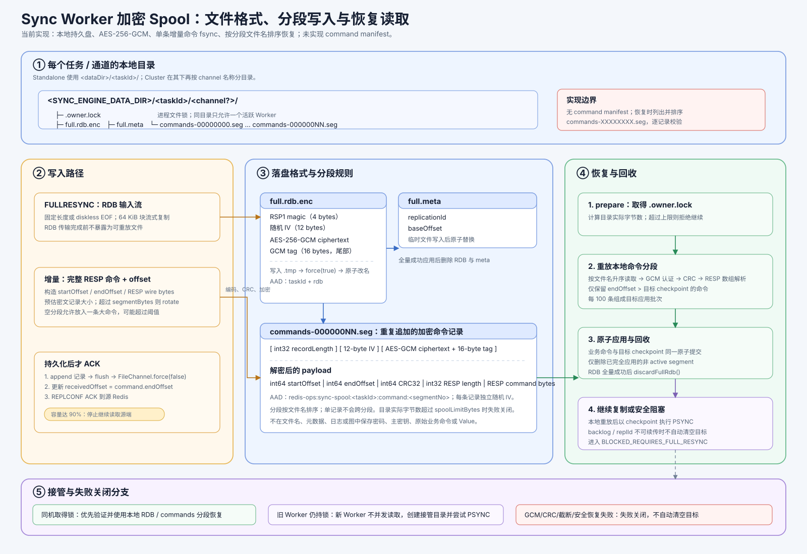
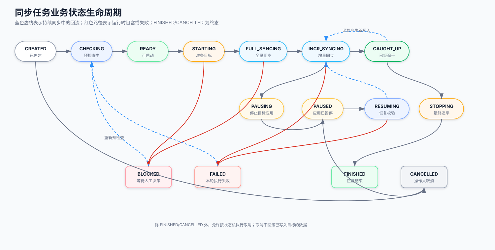
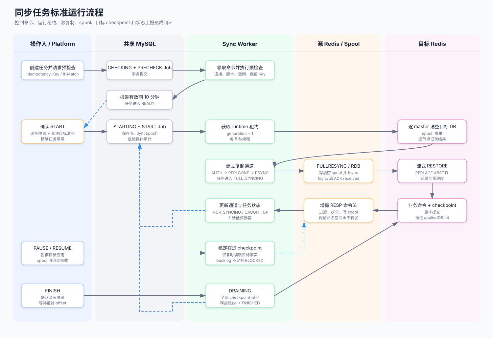

# Redis 同步 Worker 管理流程与生命周期设计

长时间 GC、进程崩溃、跨 Worker 接管及目标 Redis Fence 的详细处理见
[Sync Worker 停顿、崩溃与安全接管](sync-worker-failure-takeover.md)。

## 1. 文档目标

本文档定义自研 Redis 同步 Worker 的管理边界、状态模型、控制命令、运行租约、故障恢复和
可观测性约定。它回答以下问题：

- Platform 和 Sync Worker 分别管理什么。
- 一个同步任务从创建到结束经历哪些状态。
- START、PAUSE、RESUME 等命令如何可靠送达且避免重复执行。
- Worker 崩溃、租约失效、Redis 断线和 MySQL 中断后如何恢复。
- checkpoint、spool、MySQL 状态冲突时以谁为准。
- 主备切换工作流如何与同步任务衔接。

本文档同时描述目标设计和当前实现边界。当前代码完成度和后续差距见第 13 节。

## 2. 核心设计原则

1. **管理面与数据面分离**：Platform 管理任务和关系，Sync Worker 执行复制。
2. **期望状态与实际状态分离**：操作请求不能直接伪造 Worker 已完成某个运行阶段。
3. **控制命令至少一次投递**：重复投递必须安全，不能重复清空目标或启动两个 Runner。
4. **单任务单执行者**：运行租约和 fencing generation 阻止多个 Worker 同时应用数据。
5. **目标 checkpoint 是正确性最终事实**：MySQL offset 只用于查询和监控。
6. **先持久化再 ACK**：增量数据写入加密 spool 并 fsync 后，才能向源端 ACK received offset。
7. **失败关闭**：遇到未知 RDB 类型、不可安全拆分命令或 checkpoint 冲突时停止，不静默跳过。
8. **秘密不进入控制链路**：控制命令和任务 payload 只保存资源 ID，Worker 本地读取并解密密码。

### 2.1 命令兼容策略

同步任务创建时会固化一份 `commandPolicyJson`，Worker 始终按该快照判断增量命令，后续平台默认值
变化不会影响已创建任务。策略包含：

- `allowSafeSplit`：是否允许 `MSET`、`DEL`、`UNLINK` 按 Key/Slot 拆分。拆分后数据能够收敛，
  但不承诺原命令的跨 Key 原子性。
- `allowDestructiveCommands`：是否允许 Standalone/Sentinel 目标执行 `FLUSHDB`、`FLUSHALL`。
  Cluster 目标始终禁止，因为增量通道不能原子地完成全 master 清空。
- `additionalBlockedCommands`：任务级额外屏蔽命令，只能收紧能力，不能放开硬阻塞命令。
- `policyVersion`：策略语义版本，当前为 `v1`。

`MSETNX`、`RENAME/RENAMENX`、聚合写入、Lua/Function 调用、事务边界等无法保证等价转换或
原子性的命令属于硬阻塞，不提供放开配置。未登记的新命令采用失败关闭策略，运行时进入
`BLOCKED_UNSUPPORTED_COMMAND`，不会静默跳过。

创建任务前可调用 `GET /api/v1/sync-command-capabilities`，按目标部署模式和拟采用策略查看完整能力
清单。预检查还会读取源端 `INFO commandstats`，将历史上出现过的已知阻塞命令列为 `WARNING`。
该统计只代表历史调用，不代表命令一定会进入本任务的复制流，也无法证明未来不会出现；最终仍以
Worker 收到的真实复制命令为准。

页面展示位置包括：

- 新增同步任务弹窗中的“命令兼容策略”和“完整命令清单”。
- 任务详情中的策略快照。
- 预检查明细中的 `COMMAND_POLICY` 与 `SOURCE_COMMAND_HISTORY`。
- 任务阻塞提示和事件记录中的阻塞码、命令名、复制 offset；事件禁止记录原始 Key 和 Value。
9. **切换不等于流量变更**：Worker 负责追平和停止复制，不修改 DNS、代理或应用配置。

## 3. 组件架构



同步任务从源集群、加密 spool、全量并发处理、增量命令屏蔽到目标集群原子写入的完整数据通道见：



### 3.1 Platform 管理面

Platform 负责：

- 创建同步任务，校验长期关系或临时源目标。
- 保存 DB 映射、过滤规则、限速和 spool 上限。
- 接收 PRECHECK、START、PAUSE、RESUME、FINISH、CANCEL、RATE_LIMIT 请求。
- 校验 `Idempotency-Key`、`If-Match`、操作人和显式危险操作确认。
- 写入控制命令、任务期望状态、审计事件。
- 展示 runtime、channel、metric、precheck 和事件。
- 编排主备切换，并在条件满足后交换主备关系。

Platform 不负责：

- 建立 PSYNC 长连接。
- 解析 RDB 或增量命令。
- 保存 Redis 明文密码到任务 payload。
- 直接推进 FULL_SYNCING、INCR_SYNCING、CAUGHT_UP 等实际运行状态。
- 自动修改业务流量入口。

### 3.2 Sync Worker 数据面

Sync Worker 负责：

- 领取控制命令并维护短期命令租约。
- 竞争任务运行租约并生成 fencing generation。
- 从集群资产和秘密表读取连接信息，在本进程内解密。
- 发现 Standalone、Sentinel 或 Cluster 源通道。
- 执行 AUTH、REPLCONF、PSYNC、RDB 全量和增量命令复制。
- 管理本地加密 spool、目标 checkpoint、限速和故障恢复。
- 写 runtime、channel、metric 和同步事件。
- 根据真实执行结果上报任务状态。

Sync Worker 不允许直接修改 `cluster_relation` 的主备方向。

## 4. 持久状态及事实优先级

| 数据 | 存储位置 | 用途 | 正确性优先级 |
|---|---|---|---|
| 目标 checkpoint | 目标 Redis | 已原子应用到目标的最终 offset | 最高 |
| spool RDB、命令 segment 与元数据文件 | Worker 本地持久卷 | 已接收但可能尚未应用的数据 | 第二 |
| channel checkpoint 摘要 | MySQL | received/applied offset、通道状态和页面查询 | 第三 |
| full progress | MySQL | RDB 接收、解析、RESTORE Lane 进度观测 | 观测状态 |
| runtime | MySQL | 当前执行实例、租约、阶段、spool 用量 | 管理状态 |
| sync task | MySQL | 业务配置、期望动作和对外状态 | 管理状态 |
| async job | MySQL | 一次控制命令的可靠投递与重试 | 控制状态 |

恢复时必须按以下顺序取值：

1. 读取目标 checkpoint，确定真正的 `appliedOffset`。
2. 校验本地 spool 目录中的 RDB、`full.meta` 和命令分段，确定可重放到哪个 `receivedOffset`。
3. 校验源端 replId 和 backlog 是否仍支持 PSYNC。
4. 更新 MySQL channel 摘要；不得反过来用 MySQL offset 覆盖目标 checkpoint。

### 4.1 全量进度观测

`sync_full_progress` 按 `taskId + fullSyncEpoch + channelId + lane` 保存当前全量进度：

- `lane=-1` 是源通道汇总，记录 RDB 总量、接收和解析字节、解析及应用 Key 数。
- `lane>=0` 是 RESTORE 并发 Lane，记录该 Lane 已成功提交的 Key 数和估算写入字节数。
- 固定长度 RDB 在接收时可直接计算字节百分比；diskless EOF 模式在接收完成后补齐总字节数。
- 只有目标 Redis 的 RESTORE 事务成功后才增加 `appliedKeys`，队列中的 Key 不算已完成。
- Worker 最多每秒上报一次运行进度；页面每五秒刷新，不把高频进度写入任务事件。
- 进度表仅用于观测和页面展示，恢复和去重仍以目标 Redis checkpoint、Fence 和本地 spool 为准。

页面总体进度采用阶段权重：RDB 接收 30%、解析 20%、RESTORE 写入 50%。多源 Cluster 对各源
Master 通道取平均值，同时保留逐通道和逐 Lane 明细。该百分比用于运维观察，不参与一致性判定。

### 4.2 Spool 文件格式与恢复读取



当前 Spool 是 Worker 本地持久盘上的任务级目录。Standalone 使用
`<SYNC_ENGINE_DATA_DIR>/<taskId>/`；Cluster 在其下按通道名称创建子目录。`.owner.lock` 是独占
文件锁，同一个目录只能被一个活跃进程打开。当前实现没有 command manifest：恢复时直接列出并按
`commands-XXXXXXXX.seg` 文件名升序扫描，逐条通过 AES-GCM 认证和 CRC 校验。

全量 RDB 写入 `full.rdb.enc.tmp`，写入 `RSP1`、随机 12 字节 IV 和 AES-256-GCM 密文后执行
`force(true)`，再原子替换为 `full.rdb.enc`。`full.meta` 以原子替换的属性文件保存
`replicationId`、`baseOffset`，供全量重放与后续 PSYNC 判断使用。全量成功应用后，RDB 和元数据
会被删除。

增量命令写入递增编号的分段文件；每条记录独立使用随机 IV 与 GCM 认证标签，解密后包含命令的
开始/结束 offset、RESP wire bytes 的 CRC32 以及 RESP 编码。记录落盘后立即 `force(false)`；只有
成功 fsync 才会推进 `receivedOffset` 并向源端 ACK。按预计的加密记录大小滚动分段；单条命令不会
跨分段，因而一条大命令可使空分段超过 `segmentBytes`。目录实际字节数超过任务的
`spoolLimitBytes` 时失败关闭。

恢复时以目标 Redis checkpoint 的 `appliedOffset` 为准，仅重放 `endOffset` 更大的命令；目标
原子提交成功后，已完全应用且不是当前活动文件的分段才会被删除。任何 GCM 认证失败、CRC 不匹配、
文件截断、无法取得本地锁或无法安全执行 PSYNC 的情况都不得自动清空目标；需要时进入
`BLOCKED_REQUIRES_FULL_RESYNC`。

Spool 的 AES-256-GCM 密钥由 `REDIS_OPS_CREDENTIAL_KEYS` 的当前主密钥和任务 ID 派生。主密钥、
Redis 密码、原始命令和 Value 均不得进入 spool 元数据、日志、事件或页面。

## 5. 三条独立生命周期

### 5.1 同步任务生命周期

`sync_task.status` 是面向用户的业务状态。



| 状态 | 含义 | 状态拥有者 |
|---|---|---|
| `CREATED` | 任务配置已保存，尚未检查 | Platform |
| `CHECKING` | 预检查命令等待执行或执行中 | Platform 发起，Worker 完成 |
| `READY` | 最近十分钟内预检查通过，可确认启动 | Worker 上报 |
| `STARTING` | 已确认写隔离和目标清空，等待 Worker 启动 | Platform 发起 |
| `FULL_SYNCING` | 正在接收或应用全量 RDB | Worker 上报 |
| `INCR_SYNCING` | 正在持续应用增量命令 | Worker 上报 |
| `CAUGHT_UP` | 所有通道已追平且满足稳定性条件 | Worker 上报 |
| `PAUSING` | 正在停止目标应用并稳定 checkpoint | Platform 发起 |
| `PAUSED` | 目标应用已暂停；源数据可继续进入 spool | Worker 上报 |
| `RESUMING` | 正在校验 checkpoint、spool 和 PSYNC 条件 | Platform 发起 |
| `STOPPING` | 源已写隔离，正在追最终 offset | Platform 发起 |
| `BLOCKED` | 需要人工处理或重新确认全量 | Worker 上报 |
| `FAILED` | 本轮运行因不可恢复的执行错误失败 | Worker 上报 |
| `FINISHED` | 已按 FINISH 流程追平并正常结束 | Worker 上报，终态 |
| `CANCELLED` | 操作人取消，不保证目标形成完整副本 | Platform 发起，终态 |

`CAUGHT_UP` 不是终态。源端产生新写入后，任务可以回到 `INCR_SYNCING`。

### 5.2 控制命令生命周期

每个用户操作对应一条 `async_job`。控制命令状态独立于同步任务状态：

```text
PENDING -> RUNNING -> SUCCEEDED
                   \-> RETRY -> RUNNING
                   \-> FAILED
```

约定：

- `Idempotency-Key` 唯一标识一次业务操作，重复请求返回同一结果。
- Job `SUCCEEDED` 表示控制动作已被持久接受并产生预期效果，不表示长时间同步任务已经结束。
- START 只有在运行租约获取、目标预处理完成且 Runner 成功注册后才能标记成功。
- 长时间目标清空期间必须续租 Job；租约失效的旧实例不得继续执行。
- Job 重试前必须读取任务、runtime 和事件，判断动作是否已经完成。
- payload 只允许任务 ID 和非秘密参数，不保存密码、密文或原始 Key/Value。

### 5.3 Worker Runtime 生命周期

`sync_runtime` 表示某次任务当前由哪个 Worker 执行：

```text
IDLE
  -> CLAIMED
  -> PREPARING_TARGET
  -> FULL_RECEIVING / FULL_APPLYING
  -> INCREMENTAL
  -> PAUSED
  -> DRAINING
  -> FINISHED

任意运行阶段 -> BLOCKED / FAILED / LEASE_LOST / CANCELLED
```

Runtime 规则：

- Worker 每 5 秒续租，默认租期 30 秒。
- 获取租约时递增 `fencing_generation`。
- 续租失败后立即停止读取和目标应用，不得运行到租约自然过期以后。
- 新实例接管时使用新的 runtimeId 和 generation，旧 generation 的 checkpoint 提交必须失败。
- `phase` 比 `sync_task.status` 更细，只用于运维诊断，不作为用户直接操作入口。

## 6. 标准运行流程



### 6.1 创建与预检查

1. Platform 创建 `sync_task`，初始状态为 `CREATED`。
2. 操作人请求预检查，Platform 原子执行：
   - 校验 `If-Match`。
   - 状态改为 `CHECKING`。
   - 写 `SYNC_PRECHECK` Job。
   - 写审计记录。
3. Worker 领取 Job，检查：
   - 源、目标集群状态和连接认证。
   - 部署模式、Redis 版本和 DB 映射。
   - 源复制能力、backlog、磁盘和网络。
   - 目标写隔离、保留 Key 冲突和目标空间。
   - Module、TLS、未知持久化格式等不支持项。
   - Cluster slot、Sentinel master 和时钟偏差。
4. Worker 保存带十分钟有效期的 `sync_precheck_report`。
5. 全部通过则任务进入 `READY`，否则进入 `FAILED` 并记录错误码。

预检查只是一份短期快照。START 时必须重新执行关键安全检查，不能完全信任旧报告。

### 6.2 启动全量同步

1. 操作人提交 START，并明确确认：
   - `writeFenced=true`
   - 写隔离说明或变更单
   - `allowTargetFlush=true`
   - 精确填写任务编号
2. Platform 校验预检查未超过十分钟，将任务置为 `STARTING`，写 `SYNC_START` Job。
3. Worker 领取命令并获取任务运行租约。
4. Worker 重检源目标、写隔离确认、目标保留 Key 和自身磁盘空间。
5. Worker 将 runtime 置为 `PREPARING_TARGET`，逐目标节点执行清空：
   - Standalone/Sentinel：清空指定 DB。
   - Cluster：清空所有当前 master 的 DB 0。
   - 每个节点结果单独写事件，不静默重试失败节点。
6. Worker 建立源复制通道：
   - Standalone：一个通道。
   - Sentinel：当前 master 一个通道，并监控 master 变化。
   - Cluster：每个 master 一个通道，记录 slotRanges。
7. 每个通道执行 `AUTH -> REPLCONF -> PSYNC`。
8. FULLRESYNC 时接收 RDB 到加密 spool；fsync 后才更新 received offset 和发送 ACK。
9. 顺序解析 RDB，将匹配的 Key 放入有界队列；多个目标连接并发执行
   `RESTORE REPLACE ABSTTL`，每个连接使用受控 pipeline。
10. 等待队列清空、所有 pipeline 响应成功且没有在途 RESTORE 后，写入全量基准
    checkpoint。
11. 全量屏障完成后切换到有序增量命令流，任务进入 `INCR_SYNCING`。

目标清空和创建新 fullSyncEpoch 必须每个 epoch 只执行一次。Job 重试不能再次清空已经开始写入的目标。

全量应用并发数和 Pipeline 大小保存在 `sync_task`，创建任务时可分别设置：

```json
{
  "fullApplyConcurrency": 4,
  "fullApplyPipelineSize": 100
}
```

- `fullApplyConcurrency`：目标连接和应用线程数，允许 1～64，任务默认值为 4。
- `fullApplyPipelineSize`：单连接一次发送的最大 RESTORE 数，允许 1～10000，任务默认值为 100。
- 任务进入 `STARTING` 后不允许修改这两个参数；运行中的 ops、带宽和 spool 限制仍可调整。
- `sync.engine.full-apply-concurrency` 和 `sync.engine.full-apply-pipeline-size` 保留为旧任务兼容
  回退值。
- `sync.engine.full-apply-queue-capacity` 仍是 Worker 部署级安全配置，默认 2000；实际容量不会
  小于任务并发数。

并发仅用于全量阶段不同 Key 的 RESTORE。增量命令仍严格按 replication offset 顺序规划并与
checkpoint 原子提交。暂停时所有目标连接共用同一个写入闸门；已在途 pipeline 完成后
`pause()` 才返回。

### 6.3 增量同步与追平

每条或每批增量命令经历：

1. 从 PSYNC 流读取完整 RESP 命令并计算命令结束 offset。
2. 执行保留命名空间过滤和 include/exclude 过滤。
3. 根据目标模式拆分安全的多 Key 命令；不可等价拆分则进入 `BLOCKED_FILTER_BOUNDARY`。
4. 写入加密 spool 并 fsync。
5. 按目标节点或 slot 批量应用业务命令。
6. 业务命令和目标 checkpoint 在同一个原子提交中完成。
7. checkpoint 成功后推进 applied offset，并删除不再需要的 spool segment。
8. 默认每 1 秒将 channel 和 metric 摘要写入 MySQL；可通过
   `SYNC_ENGINE_METRIC_INTERVAL_MS` 调整。

所有通道连续三个采样周期满足目标 RPO，且指标新鲜度、时钟偏差合格时进入 `CAUGHT_UP`。

### 6.4 暂停与恢复

PAUSE 是“暂停目标应用”，不是立刻断开源复制：

1. Platform 将任务置为 `PAUSING` 并写命令。
2. Worker 停止调度新的目标批次，等待在途批次和 checkpoint 提交完成。
3. Worker 继续接收源数据并写加密 spool。
4. runtime 进入 `PAUSED`，任务进入 `PAUSED`。
5. spool 达 70% 告警；达 90% 停止从源读取。

RESUME 时：

1. Worker 验证运行租约和 generation。
2. 读取目标 checkpoint 与本地 spool 目录中的 RDB、元数据和命令分段。
3. 先重放 spool，再尝试从最后 received offset 执行 PSYNC。
4. backlog 不足时进入 `BLOCKED_REQUIRES_FULL_RESYNC`，不得自行清空目标。
5. 恢复成功后返回 `FULL_SYNCING`、`INCR_SYNCING` 或 `CAUGHT_UP`。

### 6.5 正常结束与取消

FINISH 用于有序结束：

1. 外部系统停止源端业务写入，操作人确认 `sourceWriteFenced=true`。
2. 任务进入 `STOPPING`，Worker 记录每个源通道最终 offset。
3. 等待所有目标 checkpoint 追到最终 offset。
4. 关闭 PSYNC、刷盘、释放租约，任务进入 `FINISHED`。

CANCEL 用于放弃任务：

- 停止读取和应用，关闭连接并释放租约。
- 保留审计、事件、checkpoint 和失败诊断信息。
- 清理当前任务本地 spool。
- 不自动回滚或清空已写入目标的数据。
- 任务进入 `CANCELLED`。

## 7. Worker 启动、接管和停机

### 7.1 实例启动

1. 校验数据库、数据目录、密钥环和磁盘权限。
2. 生成唯一 `instanceId`，注册健康和 Prometheus 指标。
3. 扫描本地 spool 目录及其 RDB、元数据和命令分段，标记孤儿目录和待恢复任务。
4. 查询本实例可接管的过期 runtime。
5. 开始轮询控制 Job；不得仅凭本地目录自动恢复任务。

### 7.2 崩溃接管

新 Worker 只能在旧租约过期后获取任务：

1. 原子更新 runtime，取得新 generation。
2. 从目标 Redis 读取 checkpoint。
3. 校验本地持久卷是否包含对应 spool；没有共享持久卷时尝试 PSYNC。
4. 若目标 checkpoint 到源 backlog 范围内，执行部分恢复。
5. backlog 不足则进入 `BLOCKED_REQUIRES_FULL_RESYNC`。
6. 接管事件记录旧实例、新实例、generation、恢复来源和最终决定。

### 7.3 优雅停机

- 停止领取新 Job。
- 将正在运行任务标记为 draining。
- 停止目标批次，提交在途 checkpoint。
- fsync spool，停止源读取并释放运行租约。
- 超过停机宽限时间仍未安全停止时，让租约过期，不强制提交未完成批次。

## 8. 幂等、并发和 Fencing

| 风险 | 防护 |
|---|---|
| 用户重复点击 | `Idempotency-Key` |
| 用户基于旧页面操作 | `If-Match` 和任务版本 |
| Job 重复投递 | 动作前读取 task/runtime/event，按动作和 epoch 去重 |
| 两个 Worker 领取同一命令 | async job 短租约 |
| 两个 Worker 执行同一任务 | runtime 租约 |
| 旧 Worker 恢复后继续写 | fencing generation + 目标 checkpoint WATCH |
| Worker 在目标提交后、MySQL 更新前崩溃 | 以目标 checkpoint 恢复 |
| START 重试重复清空目标 | fullSyncEpoch + 目标准备事件唯一约束 |
| 非幂等命令重复执行 | 业务命令与 checkpoint 原子提交 |

建议增加数据库唯一约束：

- `(task_id, action, request_id)`：控制动作事件去重。
- `(task_id, full_sync_epoch, target_node, stage)`：目标清空阶段去重。
- `(task_id, channel_id)`：通道唯一。

## 9. 阻塞与失败分类

`BLOCKED` 表示需要明确的恢复决策，不能自动重试：

- `BLOCKED_REQUIRES_FULL_RESYNC`
- `BLOCKED_FILTER_BOUNDARY`
- `BLOCKED_UNSUPPORTED_RDB_TYPE`
- `BLOCKED_UNSUPPORTED_COMMAND`
- `BLOCKED_RESERVED_KEY_CONFLICT`
- `BLOCKED_TARGET_CHECKPOINT_CONFLICT`
- `BLOCKED_SPOOL_LIMIT`
- `BLOCKED_VERSION_INCOMPATIBLE`
- `BLOCKED_TARGET_NOT_FENCED`

`FAILED` 表示当前执行轮次失败，但允许重新预检查：

- 密钥无法解密。
- 数据库 schema 不兼容。
- 本地 spool 损坏且无法恢复。
- 目标清空部分失败。
- Runner 内部异常或配置错误。

网络抖动、短暂 Redis 断线和临时 MySQL 错误应先进行有限次数退避重试，不立即进入 FAILED。
所有错误日志禁止输出密码、密文、原始 Key 和 Value。

## 10. RPO 与可观测性

每个通道至少暴露：

- replicationId、receivedOffset、appliedOffset、offsetGap。
- source/apply ops/s 和 bytes/s。
- backlog、spool bytes、spool 使用率。
- timestamp lag、estimated lag、RPO 计算方式和可信度。
- reconnect、FULLRESYNC 次数和最后错误码。
- runtime lease owner、leaseUntil、generation 和续租失败次数。

任务级 RPO 取所有源通道最大值。MySQL 每 5 秒保存一次低频摘要，Prometheus 保留高频指标。

健康检查分为：

- `liveness`：进程和调度线程存活。
- `readiness`：MySQL、密钥环和数据目录可用，可以领取新任务。
- 单任务健康：租约、源连接、目标连接、spool 和 checkpoint 是否正常。

## 11. API、命令与状态映射

| API | 控制 Job | 请求后的任务状态 | Worker 成功结果 |
|---|---|---|---|
| `POST /prechecks` | `SYNC_PRECHECK` | `CHECKING` | `READY` 或 `FAILED` |
| `POST /start` | `SYNC_START` | `STARTING` | `FULL_SYNCING` |
| `POST /pause` | `SYNC_PAUSE` | `PAUSING` | `PAUSED` |
| `POST /resume` | `SYNC_RESUME` | `RESUMING` | 运行态或 `BLOCKED` |
| `POST /finish` | `SYNC_FINISH` | `STOPPING` | `FINISHED` |
| `POST /cancel` | `SYNC_CANCEL` | `CANCELLED` | runtime 释放 |
| `PUT /limits` | `SYNC_RATE_LIMIT` | 原状态 | Runner 使用新限速 |

所有写接口要求 `Idempotency-Key` 和 `If-Match`。`X-Operator` 只用于审计，不承担权限认证。

## 12. 与主备切换的衔接

长期主备切换只允许使用处于 `CAUGHT_UP` 的关联任务，并要求：

1. 连续三个采样周期满足关系目标 RPO。
2. 指标新鲜度不超过 5 秒，时钟偏差不超过 2 秒。
3. 外部停止旧主写入并确认 source fence。
4. Worker 执行 FINISH，追到所有通道最终 offset。
5. 切换工作流进入 `WAITING_EXTERNAL_SWITCH`。
6. 外部流量切换完成后，Platform 交换主备关系并创建反向全量任务。

Worker 只报告“最终 offset 已追平”，不自行交换关系，也不启动未经 Platform 确认的反向同步。

## 13. 当前实现与目标差距

当前已经具备：

- 独立 Sync Service 启动模块。
- V7 runtime、channel、precheck、metric 数据结构和 Repository。
- 控制 API、异步 Job 领取框架、预检查和目标清空基础代码。
- Standalone 到 Standalone 的真实复制 Runner，不再使用启动即拒绝的占位实现。
- 基于 Java Socket 的 AUTH、REPLCONF、PSYNC、FULLRESYNC、CONTINUE 和周期 ACK。
- 固定长度和 diskless EOF 两种 RDB 传输，以及 RDB CRC64 校验。
- Redis 5.0 至 8.4 内置 RDB 类型的流式解析，包括紧凑编码、TTL、Stream Consumer
  Group 和 Functions；Module、未知类型及损坏数据失败关闭。
- RDB 通过带目标 Fence 的 `RESTORE REPLACE ABSTTL` 事务批次应用，Functions 使用相同写屏障。
- 原始 RESP 增量命令解析和精确 replication offset 计算。
- include/exclude、保留命名空间、可拆多 Key 命令和不安全命令阻塞。
- 业务命令与目标 checkpoint 在同一个 `WATCH + MULTI/EXEC` 中提交，并同时监视目标 Fence。
- MySQL 租约 generation 与目标 Redis Fence 双重 fencing；恢复以目标 checkpoint 为最终事实，
  MySQL 仅保存摘要。
- AES-256-GCM 加密 RDB 和增量 spool、随机 IV、完整性校验、fsync 后 ACK、分段回收和
  spool 容量保护。
- 暂停时关闭目标应用闸门但继续接收源数据，恢复时先重放 spool 再执行部分 PSYNC。
- 全量 RDB 使用可配置目标连接池和 pipeline 并发 RESTORE；每个 lane 受目标 Fence、
  pipeline 数量和事务字节上限保护，有界队列提供内存背压。
- Runner Manager、单实例并发上限、运行租约领取及定时续租。
- Runner 生命周期接口，以及 prepare/start/pause/resume/finish/cancel/limits 管理闭环。
- 专用续租线程、单调时钟 Lease Guard 和安全截止时间；长 GC 恢复后不能补续租继续写。
- 过期 runtime 自动安全接管、目标 Fence 原子发布、本地 spool 文件锁及跨机器 PSYNC 恢复。
- 运行中 PAUSE、FINISH、RATE_LIMIT 只允许 runtime owner 领取；租约过期后其他 Worker
  才能接管 RESUME、CANCEL。
- 每任务 RPO 心跳、received/applied offset、吞吐、spool 和低频指标摘要。
- 无认证和 ACL 的真实 Redis 集成测试，覆盖全量数据类型、TTL、Stream Group、增量
  `INCR/LPUSH`、暂停恢复和新 generation 接管。
- Standalone/Sentinel 任意组合的单数据通道执行：Worker 通过 Sentinel
  `GET-MASTER-ADDR-BY-NAME` 解析当前数据节点，不会把 Sentinel 控制端口当作 Redis 数据端口。
- Sentinel 源端每秒核对当前 master，即使旧连接未断开也会切换到新 master，并优先使用
  `PSYNC replId offset` 继续；backlog 或 replId 不兼容时安全进入
  `BLOCKED_REQUIRES_FULL_RESYNC`。
- Sentinel 目标端连接失败或旧主返回只读错误时重新解析当前 master；增量恢复先读取目标
  checkpoint，解决 `EXEC` 已提交但响应丢失的歧义，全量 RESTORE 则依靠
  `REPLACE ABSTTL` 安全重放。
- Cluster 源端按当前 master 建立独立 PSYNC 通道，每个通道保存自己的 replId、offset、
  slotRanges 和加密 spool；源 master 地址变化但 Slot 集合不变时可按 checkpoint 续传，
  在线 reshard 导致 Slot 集合变化时失败关闭。
- Cluster RDB 支持官方 `SLOT_INFO` 元数据；业务 Key 仍按 RDB value type 生成
  `RESTORE REPLACE ABSTTL`，平台元数据不写入目标业务空间。
- Cluster 目标按 Redis Slot 路由，每个 Slot 使用同 Slot fence/checkpoint 保证事务原子性；
  通道另有保守 cursor，只有一个批次涉及的全部 Slot 都成功后才推进，部分提交恢复时按
  Slot checkpoint 去重后补齐未完成 Slot。
- Cluster 全量并发受任务级总并发信号量限制，增量限速在多个源通道之间共享，避免把每个
  master 的配置误乘为任务总上限。
- 已通过 Cluster→Cluster、Standalone→Cluster 和 Cluster→Standalone 真实容器验收，
  包含三源 master、跨 Slot 可拆命令、暂停恢复和更高 generation 接管。

当前尚未具备：

- Sentinel 源、目标真实 failover 容器演练；当前协议、解析、周期 master 检查和安全重连代码
  已完成，但上线验收仍需验证 Sentinel 选主、旧主降级和 backlog 续传。
- Redis 5.0、6.2、7.4、8.0、8.4 的同版本 Standalone 容器矩阵已经通过；跨版本
  旧版本到新版本矩阵、Cluster 多版本矩阵和可持久复用的 golden RDB fixture 尚未完成。
- 100 GB 全量和持续 5 万 ops/s 性能基准；当前 RDB 按 Key 流式处理，但单个超大 Key
  的 DUMP payload 仍会占用对应大小的内存。
- 256 MiB 分段下的 50 GiB 长时间 spool 压力、磁盘满和进程崩溃注入矩阵。
- 50 GiB spool、MySQL 长时间中断和真实双进程 Stop-The-World GC 的压力及故障注入矩阵。
- 跨主机共享或对象存储 spool；当前按本地盘加 PSYNC 处理，backlog 不足时安全阻塞。
- Prometheus 高频指标导出；目前已保存 MySQL 低频摘要。
- 完整预检查、逐节点清空阶段幂等事件和主备切换闭环验收。
- TLS、Module 数据和 Active-Active；它们仍按首期范围明确不支持。

因此当前代码已经达到 M2 的 Standalone 与 Cluster 功能闭环，并具备 Sentinel 单通道运行
实现；在完成 Sentinel 真实 failover、Cluster 多版本、100 GB/5 万 ops/s 和故障矩阵前，
尚不应宣称完成高可用拓扑的生产验收。

## 14. 分阶段验收

### M1：管理生命周期闭环

- Sync Service 可编译、启动并通过 readiness。
- 控制 Job 可幂等领取、续租、完成和失败重试。
- runtime 可竞争、续租、释放并阻止双实例。
- 所有任务状态只能按状态机迁移。

### M2：Standalone 最小复制闭环

- Standalone 到 Standalone 完成全量和增量。
- 非幂等命令在故障注入后不重复应用。
- 暂停、spool、恢复和部分重同步有效。

当前状态：功能、自动化集成测试和 Redis 5.0/6.2/7.4/8.0/8.4 同版本容器矩阵已完成；
跨版本、性能及完整故障注入属于上线前验收项。

### M3：高可用与 Cluster

- Sentinel master 切换自动重连。
- Cluster 每 master 独立通道并正确路由目标 slot。
- 多实例接管、磁盘满和 MySQL 中断测试通过。

当前状态：Cluster 功能和三种拓扑转换的真实容器验收完成；Sentinel 执行与重连代码完成，
真实 failover 演练待补。Cluster 多版本、在线 failover/reshard 和压力故障矩阵属于上线前
验收项。

### M4：切换验收

- RPO 连续稳定判定。
- source fence、最终 offset、外部流量确认和反向全量流程通过。
- 全链路审计不包含密码、密文、原始 Key 或 Value。
